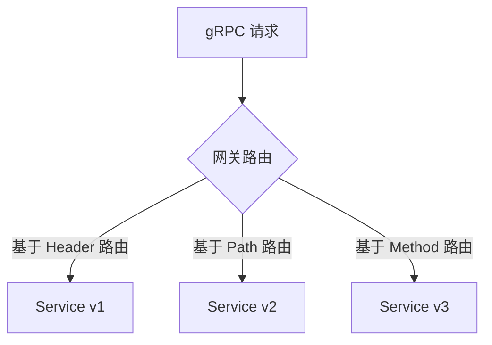
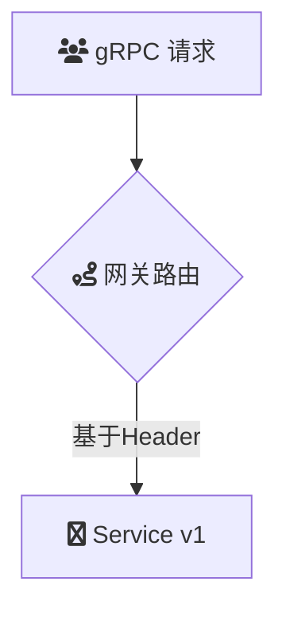

# [WIP]Intro
云原生 API 网关实现 gRPC 服务的转发 

作为云原生架构的核心基础设施，云原生API 网关通过原生支持 gRPC 协议（基于 HTTP/2 的高性能 RPC 框架），提供完整的协议感知能力，实现对 gRPC 服务的智能路由、协议转换和全生命周期管理。其核心价值在于统一南北向流量治理，同时保持 gRPC 的低延迟、流式传输等特性。

## Summary
### 场景描述
1. **异构协议环境**：在混合部署架构中，前端使用 RESTful API 而微服务间采用 gRPC 通信
2. **服务治理需求**：需要对 gRPC 流量实施精细化的服务治理策略（熔断、限流、鉴权）
3. **流式处理**：支持 gRPC 流式调用（Unary/Client Streaming/Server Streaming/Bidirectional Streaming）

### 应用场景
| 场景类型 | 技术实现 | 典型用例 |
|---------|--------|---------|
| 协议转换网关 | gRPC-JSON Transcoding | 移动端通过 REST API 访问后端 gRPC 服务 |
| 服务治理枢纽 | 基于 ProtoBuf 的流量分析 | 对 gRPC 方法级粒度的 QPS 控制 |
| 实时通信 | 流式长连接管理 | IoT 设备状态实时同步 |

### 解决问题
1. **协议鸿沟**  
   - 实现 HTTP/1.1 与 HTTP/2 协议栈的自动转换
   - 通过 Protocol Buffers 定义实现请求/响应的动态编解码

2. **流量治理**  

## Architecture

	

## deploy

## usage