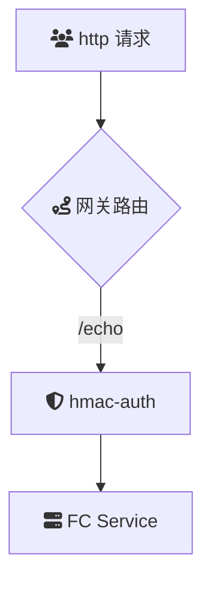

# 概述
AK/SK(hmac-auth)是一种基于HMAC（Hash-based Message Authentication Code）算法的签名认证方式。客户端在调用API时，需要使用签名密钥（SK）对请求内容进行签名计算，并将签名以及访问密钥（AK）一并传输给服务器端进行签名验证。此机制确保了请求的真实性和完整性，防止未授权访问和请求篡改。

### 场景描述
在现代云原生架构中，API网关扮演着关键的角色，负责管理、路由和保护进入的API请求。随着微服务和分布式系统的普及，API的调用频率和复杂性显著增加，传统的鉴权方式（如简单的API Key或Token认证）在安全性和可扩展性方面逐渐暴露出不足。AK/SK鉴权通过HMAC算法提供更高层次的安全保障，适用于需要严格身份验证和数据完整性的场景。

### 应用场景
1. **金融科技**：在金融交易和支付系统中，确保每一笔请求的真实性和完整性，防止交易篡改和伪造。
2. **云服务平台**：保护云资源的API接口，确保只有授权用户能够访问和操作资源，防止滥用和数据泄露。
3. **物联网（IoT）**：设备与服务器之间的通信需要高安全性，AK/SK鉴权保证设备发送的指令和数据的真实性。
4. **电子商务**：保护用户的交易请求和个人信息，防止恶意攻击和数据篡改，提升用户信任度。
5. **企业内部系统**：在微服务架构中，确保各服务之间的通信安全，防止内部数据泄露和未经授权的访问。
6. **移动应用后端**：保护移动应用与后端API的通信，防止请求被截获和篡改，确保用户数据安全。

### 解决问题
1. **增强安全性**：相比传统的API Key 鉴权，AK/SK结合HMAC算法提供了更高的安全性，防止密钥泄露后被滥用。
2. **请求防篡改**：通过HMAC签名，确保请求在传输过程中未被修改，保证数据的完整性和一致性。
3. **身份验证**：验证请求者的身份，确保只有持有合法AK/SK的用户才能访问API，防止未授权访问。
4. **防止重放攻击**：结合时间戳或唯一随机数（nonce）使用，防止攻击者重复发送合法请求，确保请求的新鲜性。
5. **无状态鉴权**：无需在服务器端存储会话或状态信息，简化服务器架构，提升系统可扩展性。
6. **统一鉴权机制**：在API网关层统一处理AK/SK鉴权，减少后端服务的复杂度和负担，提高整体系统的维护性。
7. **灵活性和兼容性**：支持多种HMAC算法（如HMAC-SHA256），适应不同的安全需求和性能要求，便于集成到现有系统中。
8. **审计和监控**：通过记录和验证每个请求的签名，提供详细的审计日志，便于安全监控和问题追踪。

## 架构



本示例`hmac-auth`插件的配置如下：

> 更多配置详情，请查阅[Github 文档](https://github.com/alibaba/higress/blob/main/plugins/wasm-go/extensions/hmac-auth/README.md)

```
consumers:
	- credential: 2bda943c-ba2b-11ec-ba07-00163e1250b5
		name: consumer1
	keys:
	- x-api-key
```

## 部署

## usage

1. 发起未经鉴权的请求
   首先，尝试不带任何鉴权信息发起请求：

```
curl -iv env-cu9g82mm1hkui0vcv5eg-cn-hangzhou.alicloudapi.com/get
```

预期返回结果：

```
HTTP/1.1 401 Unauthorized
```

说明：
返回 401 Unauthorized 表示未提供有效的鉴权信息，访问被拒绝。

2. 发起带鉴权 Header 的请求
   为确保请求通过鉴权，请在请求头中添加 x-api-key。以下是示例命令：

```
curl -iv -H "x-api-key:2bda943c-ba2b-11ec-ba07-00163e1250b5" env-cu9g82mm1hkui0vcv5eg-cn-hangzhou.alicloudapi.com/get
```

预期返回结果：

```
{
  "args": {},
  "headers": {
    "Accept": "*/*",
    "Accept-Encoding": "gzip",
    "Host": "key-autlugin-eb-cxjqtcveqb.cn-hangzhou-vpc.fcapp.run",
    "Original-Host": "env-cu9g82mm1hkui0vcv5eg-cn-hangzhou.alicloudapi.com",
    "Req-Start-Time": "1738167625960",
    "User-Agent": "curl/8.6.0",
    "X-Api-Key": "2bda943c-ba2b-11ec-ba07-00163e1250b5",
    "X-Envoy-Attempt-Count": "1",
    "X-Envoy-External-Address": "183.157.254.75",
    "X-Envoy-Original-Host": "env-cu9g82mm1hkui0vcv5eg-cn-hangzhou.alicloudapi.com",
    "X-Mse-Consumer": "consumer1"
		...
  },
  "origin": "183.157.254.75, 100.117.33.90",
  "url": "http,http://key-autlugin-eb-cxjqtcveqb.cn-hangzhou-vpc.fcapp.run/get"
}
```

关键点说明：

鉴权成功标识：返回头部中的 X-Mse-Consumer: consumer1 表明 key-auth 插件已成功识别并认证调用者名称为 consumer1。
请求详情：响应中包含了原始请求的详细信息，帮助您验证请求路径和源地址等信息。 3. 注意事项
API 密钥：确保使用的 x-api-key 与网关配置中的密钥匹配。
请求 URL：使用正确的网关实例域名发起请求，避免拼写错误。
安全性：请妥善保管您的 API 密钥，避免泄露。
