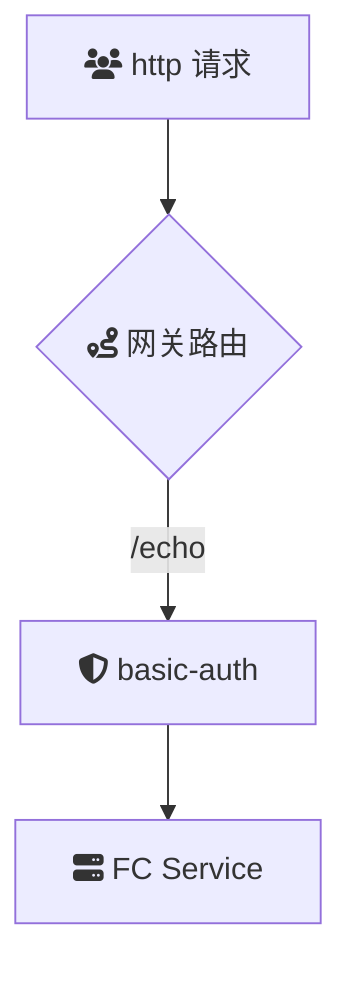

# intro
`basic-auth`插件实现了基于 HTTP Basic Auth 标准进行认证鉴权的功能。该插件通过解析HTTP请求中的`Authorization`头部，验证用户提供的用户名和密码，从而控制对API资源的访问权限。Basic Auth作为一种简单且广泛支持的认证机制，适用于多种应用场景，尤其是在需要快速部署和轻量级认证的环境中。

## summary
### 场景描述
在现代云原生架构和微服务环境中，API网关作为统一的入口，承担着请求路由、负载均衡、安全控制等多重职责。随着服务数量和请求量的快速增长，确保每个请求的合法性和安全性变得尤为重要。HTTP Basic Auth（基本认证）作为一种简洁、标准化的认证方式，被广泛应用于各种API访问控制场景。然而，Basic Auth在实际应用中也面临安全性和管理上的挑战，需要结合其他安全措施以增强整体的认证机制。

### 应用场景
1. **内部服务通信**：在企业内部网络或受信任的环境中，各微服务之间可以使用Basic Auth进行简单而有效的身份验证，确保服务间的安全通信。
2. **开发和测试环境**：在开发和测试阶段，Basic Auth提供了一种快速设置认证机制的方法，无需复杂的配置，方便团队进行功能验证和调试。
3. **管理接口保护**：保护API网关的管理和监控接口，确保只有授权的管理员能够访问和操作核心配置，防止未经授权的修改和访问。
4. **轻量级应用**：适用于对安全要求不高、用户数量较少的轻量级应用或服务，简化认证流程，提高开发效率。
5. **临时访问控制**：为特定用户或服务提供临时访问权限，方便灵活地管理短期项目或合作伙伴的API访问。
6. **集成第三方工具**：与某些不支持更复杂认证方式的第三方工具和服务集成时，Basic Auth作为通用的认证方法被广泛采用，确保兼容性和互操作性。

### 解决问题
1. **简化认证流程**：通过遵循HTTP Basic Auth标准，简化了身份验证的实现和配置，使开发和运维团队能够快速部署认证机制。
2. **增强访问控制**：确保只有提供正确用户名和密码的请求才能访问受保护的API资源，有效防止未授权访问和资源滥用。
3. **广泛兼容性**：Basic Auth作为HTTP协议的一部分，几乎所有的HTTP客户端和服务器都支持该认证方式，便于集成和跨平台应用。
4. **无状态认证**：每个请求都包含认证信息，无需服务器端存储会话状态，提高系统的可扩展性和性能，有助于应对高并发请求。
5. **快速部署**：适用于需要快速上线且认证需求相对简单的项目，帮助团队在短时间内部署基本的安全措施，缩短产品发布周期。
6. **与HTTPS结合使用**：通过与TLS/SSL协议结合，确保传输过程中的认证信息加密，提升通信安全性，解决Basic Auth固有的安全风险，如凭证泄露和中间人攻击。
7. **统一认证机制**：在API网关层统一处理Basic Auth认证，减少后端服务的重复实现，提升整体系统的维护性和一致性。
8. **审计和监控**：通过记录和验证每个请求的认证信息，提供详细的审计日志，便于安全监控、问题追踪和合规审查。


## Architecture



本示例`key-auth`插件的配置如下：

> 更多配置详情，请查阅[Github 文档](https://github.com/alibaba/higress/blob/main/plugins/wasm-go/extensions/key-auth/README.md)

```
consumers:
- credential: 'admin:123456'
  name: consumer1
- credential: 'guest:abc'
  name: consumer2
```

## deploy

## usage

1. 发起未经鉴权的请求
   首先，尝试不带任何鉴权信息发起请求：

```
curl -iv env-cu9g82mm1hkui0vcv5eg-cn-hangzhou.alicloudapi.com/get
```

预期返回结果：

```
HTTP/1.1 401 Unauthorized
```

说明：
返回 401 Unauthorized 表示未提供有效的鉴权信息，访问被拒绝。

2. 发起带鉴权 Header 的请求
   用户名密码需要编码为 base64格式。通过 `echo -n "guest:abc" | base64`得出base64编码为`Z3Vlc3Q6YWJj`，为确保请求通过鉴权，直接指定 `Authorization` 请求头发起请求如下：
```
 curl -iv  -H 'Authorization: Basic Z3Vlc3Q6YWJj'  env-cu9g82mm1hkui0vcv5eg-cn-hangzhou.alicloudapi.com/get
```

预期返回结果：

```
{
  "args": {},
  "headers": {
    "Accept": "*/*",
    "Accept-Encoding": "gzip",
    "Host": "key-autlugin-eb-cxjqtcveqb.cn-hangzhou-vpc.fcapp.run",
    "Original-Host": "env-cu9g82mm1hkui0vcv5eg-cn-hangzhou.alicloudapi.com",
    "Req-Start-Time": "1738167625960",
    "User-Agent": "curl/8.6.0",
    "X-Api-Key": "2bda943c-ba2b-11ec-ba07-00163e1250b5",
    "X-Envoy-Attempt-Count": "1",
    "X-Envoy-External-Address": "183.157.254.75",
    "X-Envoy-Original-Host": "env-cu9g82mm1hkui0vcv5eg-cn-hangzhou.alicloudapi.com",
    "X-Mse-Consumer": "consumer2"
		...
  },
  "origin": "183.157.254.75, 100.117.33.90",
  "url": "http,http://key-autlugin-eb-cxjqtcveqb.cn-hangzhou-vpc.fcapp.run/get"
}
```

关键点说明：

鉴权成功标识：返回头部中的 `X-Mse-Consumer: consumer2` 表明 `basic-auth`插件已成功识别并认证调用者名称为` consumer2`。
请求详情：响应中包含了原始请求的详细信息，帮助您验证请求路径和源地址等信息。 3. 注意事项
API 密钥：确保使用的 `x-api-key` 与网关配置中的密钥匹配。
请求 URL：使用正确的网关实例域名发起请求，避免拼写错误。
安全性：请妥善保管您的 API 密钥，避免泄露。
