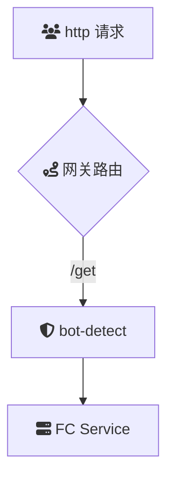

# 概述

**bot-detect**：Bot 拦截

**bot-detect** 是一款用于云原生 API 网关的 Bot 拦截插件，旨在识别并阻止恶意或不受欢迎的互联网爬虫对站点资源的爬取。通过分析请求的 User-Agent 有效区分人类用户与自动化脚本，保护网站资源免受滥用和潜在攻击的影响。

### 场景描述

在当今互联网环境中，网站和在线服务面临大量来自自动化脚本和爬虫的访问请求。这些请求可能用于数据抓取、内容盗用、资源消耗甚至发动分布式拒绝服务（DDoS）攻击，严重影响网站的性能和用户体验。传统的防护手段往往难以精准识别和拦截恶意 Bot，导致合法用户和恶意请求混杂，增加了管理和维护的复杂性。**bot-detect** 插件应运而生，提供了一种高效且灵活的解决方案，以应对复杂多变的 Bot 攻击和滥用行为。

### 应用场景

1. **防止数据抓取和内容盗用**：
   - 识别并阻止未经授权的爬虫抓取网站内容，保护知识产权和商业机密。
2. **防御 DDoS 攻击**：
   - 通过检测异常高频率的请求流量，自动拦截潜在的 DDoS 攻击，保障系统的可用性。
3. **保护电子商务平台**：
   - 阻止自动化脚本抢购、刷库存等行为，确保公平交易环境，提升用户体验。
4. **提升网站性能**：
   - 减少由恶意 Bot 引起的资源消耗，优化服务器性能，提升合法用户的访问速度。
5. **防止表单滥用**：
   - 拦截自动化提交的表单请求，防止垃圾信息和恶意操作，维护网站的正常运转。
6. **增强 API 安全**：
   - 保护 API 接口免受恶意调用，确保数据和服务的安全，防止滥用和数据泄露。
7. **监控和分析 Bot 行为**：
   - 通过详细的日志和分析功能，了解 Bot 的行为模式，优化防护策略，及时应对新的威胁。

### 解决问题

- **精准识别恶意 Bot**：通过多层次的检测机制，准确区分合法用户与恶意 Bot，减少误拦截率，保障用户体验。
- **提升系统安全性**：有效阻止自动化脚本带来的潜在攻击和滥用行为，保护网站和服务的安全。
- **优化资源利用**：减少由恶意 Bot 引起的服务器资源消耗，提升系统的整体性能和响应速度。
- **简化防护管理**：提供灵活的配置和自动化的拦截策略，降低运维人员的管理负担，提升防护效率。
- **增强用户体验**：通过过滤掉恶意请求，确保合法用户能够顺畅访问和使用网站资源，提升满意度。
- **支持动态调整和扩展**：根据实时的流量和威胁情报，动态调整检测规则和拦截策略，适应不断变化的攻击手法。
- **提供详尽的监控和日志**：记录和分析 Bot 的活动，协助运维和安全团队进行威胁评估和响应，提升整体防护能力。
- **降低运营成本**：通过自动化的 Bot 拦截，减少因恶意流量带来的额外成本支出，优化运营资源分配。

## 架构



本示例`bot-detect`插件的配置如下：

> 更多配置详情，请查阅[Github 文档](https://github.com/alibaba/higress/blob/main/plugins/wasm-go/extensions/bot-detect/README.md)

```yaml
deny:
  - "spd-tools.*"
blocked_message: "禁止访问"
```

1. 发起未配置安全防护的请求
   首先，尝试不带任何安全防护信息发起请求:

```
curl -iv 'http://env-cu9g82mm1hkui0vcv5eg-cn-hangzhou.alicloudapi.com/get'
```

预期返回结果：

```
{
  "args": {},
  "headers": {
    "Accept-Encoding": "gzip",
    "Host": "bot-detlugin-si-ytfguzwtvc.cn-hangzhou-vpc.fcapp.run",
    "Original-Host": "env-cu9g82mm1hkui0vcv5eg-cn-hangzhou.alicloudapi.com",
    "Req-Start-Time": "1739170066328",
    "User-Agent": "Go-http-client/1.1",
    "X-Envoy-Attempt-Count": "1",
    "X-Envoy-Internal": "true",
    "X-Envoy-Original-Host": "env-cu9g82mm1hkui0vcv5eg-cn-hangzhou.alicloudapi.com",
    "X-Envoy-Route-Identifier": "true",
    "X-Fc-Access-Key-Id": "",
    "X-Fc-Access-Key-Secret": "",
    "X-Fc-Account-Id": "1419633767709936",
    "X-Fc-Api-Server-Ip": "",
    "X-Fc-Base-Path": "/get",
    "X-Fc-Client-Ip": "",
    "X-Fc-Control-Path": "/http-invoke",
    "X-Fc-Eagleeye-Rpcid": "",
    "X-Fc-Eagleeye-Traceid": "",
    "X-Fc-Eagleeye-Userdata": "",
    "X-Fc-Function-Handler": "index.handler",
    "X-Fc-Function-Memory": "1024",
    "X-Fc-Function-Name": "bot-detect-plugin-s33i",
    "X-Fc-Function-Timeout": "3",
    "X-Fc-Qualifier": "LATEST",
    "X-Fc-Region": "cn-hangzhou",
    "X-Fc-Request-Id": "1-67a9a112-154ff5fe-a091711f4653",
    "X-Fc-Retry-Count": "0",
    "X-Fc-Security-Token": "",
    "X-Fc-Service-Logproject": "",
    "X-Fc-Service-Logstore": "",
    "X-Fc-Service-Name": "",
    "X-Fc-Tracing-Jaeger-Endpoint": "",
    "X-Fc-Tracing-Opentracing-Span-Baggages": "",
    "X-Fc-Tracing-Opentracing-Span-Context": "",
    "X-Fc-Version-Id": ""
  },
  "origin": "172.16.19.194, 100.117.33.159",
  "url": "http,http://bot-detlugin-si-ytfguzwtvc.cn-hangzhou-vpc.fcapp.run/get"
}
```

2. 发起带安全防护 Header 的请求
   为确保请求时触发安全防护，请在请求头中的 User-Agent 配置 spd-tools 参数，以下是示例命令：

```
curl -iv 'http://env-cu9g82mm1hkui0vcv5eg-cn-hangzhou.alicloudapi.com/get' -H 'User-Agent: spd-tools'
```

预期返回结果：

```
<!-- 返回内容可通过  blocked_message 配置 -->
禁止访问
```
