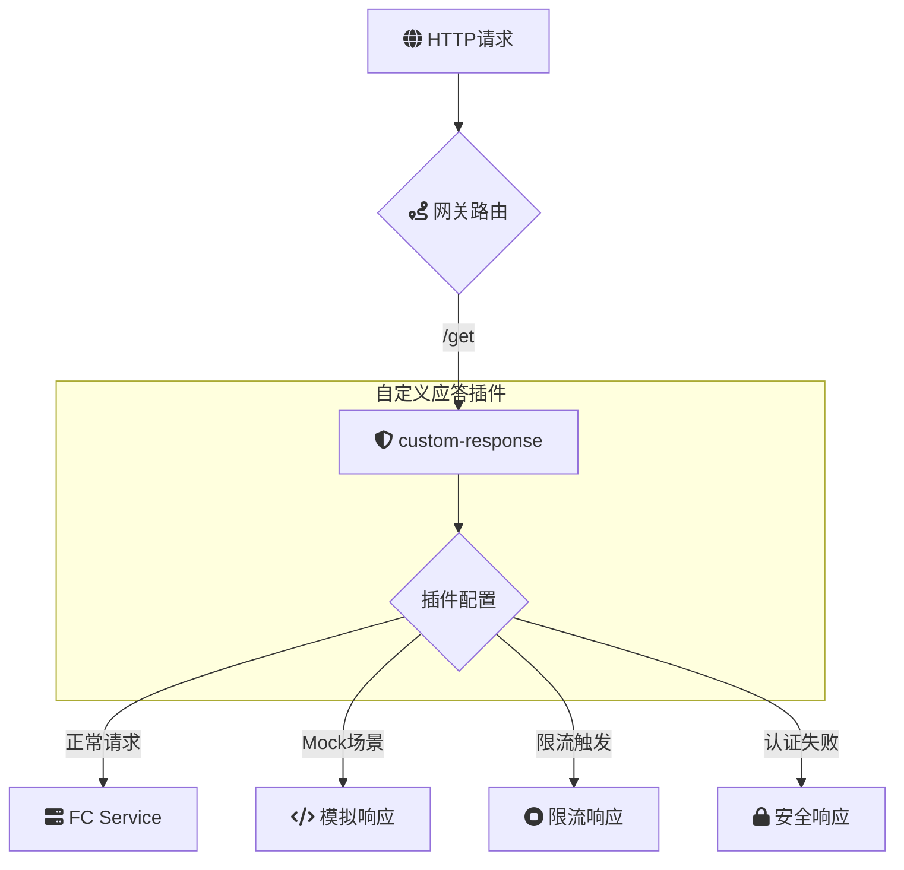

# 概述

**custom-response**：自定义应答

**custom-response** 是一款用于云原生 API 网关的自定义应答插件，允许用户根据特定条件配置自定义的 HTTP 响应。该插件支持自定义 HTTP 响应状态码、响应头以及响应体内容，能够用于模拟响应（Mock）、在触发特定策略（如限流、身份验证失败等）时返回定制化的错误信息，或根据业务需求动态调整响应内容，提升 API 的灵活性和用户体验。

### 场景描述

在现代云原生应用和微服务架构中，API 网关扮演着流量控制、协议转换、安全防护等关键角色。不同的业务场景和需求可能需要对特定的请求做出不同的响应处理。例如，在开发和测试阶段，开发人员可能需要模拟某些服务的响应；在生产环境中，当触发限流或身份验证失败时，需要返回符合业务逻辑的错误信息；在实施 A/B 测试时，根据不同的用户群体返回不同的响应内容。**custom-response** 插件提供了灵活的配置能力，以满足这些多样化的需求，增强 API 服务的可控性和扩展性。

### 应用场景

1. **接口模拟（Mock）**：在开发和测试阶段，通过自定义响应模拟后端服务，提高开发效率，降低对真实服务的依赖。 
2. **限流错误处理**：当 API 网关触发限流策略时，返回定制化的错误信息和状态码，提升客户端的错误处理能力和用户体验。
3. **身份验证失败响应**：在认证或授权失败时，返回符合业务规范的错误响应，确保安全性和一致性。
4. **A/B 测试**：根据用户属性或请求条件，返回不同的响应内容，用于评估不同功能或版本的效果。
5. **动态内容调整**：根据实时业务需求或运营策略，动态调整响应内容，如在特定促销期间返回特殊的优惠信息。
6. **安全防护**：在检测到异常请求或潜在攻击时，返回统一的安全响应，防止信息泄露和系统攻击。
7. **内容协商**：根据请求头中的内容协商信息，返回不同格式或语言的响应内容，提升国际化支持。

### 解决问题

- **提升开发和测试效率**：通过接口模拟，开发人员无需依赖真实后端服务即可进行前端开发和集成测试，缩短开发周期。
- **优化错误处理和用户体验**：自定义限流及错误响应，使客户端能够准确理解错误原因并做出相应处理，提升用户体验。
- **增强安全性**：在身份验证失败或检测到恶意请求时返回统一的安全响应，防止敏感信息泄露，提升系统的整体安全性。
- **支持复杂业务需求**：通过灵活配置响应内容和条件，满足复杂的业务逻辑和动态调整需求，增强 API 的适应性和扩展性。
- **简化运维管理**：提供清晰的配置接口和详细的日志记录，方便运维人员监控和调整自定义响应策略，确保系统的稳定运行。
- **实现精细化流量控制**：结合其他网关策略，如限流、路由等，实现更加精细化的流量控制和响应管理，提高系统的灵活性和可靠性。
- **提升测试覆盖率**：通过自定义响应模拟各种边界和异常情况，增强测试覆盖率，确保系统在各种场景下的稳定性和健壮性。
- **灵活的内容管理**：根据业务需求动态调整响应内容，无需修改后端服务代码，提升内容管理的灵活性和效率。

## 架构



本示例 `custom-response` 插件的配置如下：

> 更多配置详情，请查阅[Github 文档](https://github.com/alibaba/higress/blob/main/plugins/wasm-go/extensions/custom-response/README.md)

### Mock 应答场景

```yaml
status_code: 200
headers:
  - Content-Type=application/json
  - Hello=World
body: '{"hello":"world"}'
```

根据该配置，请求将返回自定义应答如下：

```text
HTTP/1.1 200 OK
Content-Type: application/json
Hello: World
Content-Length: 17

{"hello":"world"}
```

### 触发限流时自定义响应

```yaml
enable_on_status:
  - 429
status_code: 302
headers:
  - Location=https://example.com
```

触发网关限流时一般会返回 `429` 状态码，这时请求将返回自定义应答如下：

```text
HTTP/1.1 302 Found
Location: https://example.com
```

从而实现基于浏览器 302 重定向机制，将限流后的用户引导到其他页面，比如可以是一个 CDN 上的静态页面。

如果希望触发限流时，正常返回其他应答，参考 Mock 应答场景配置相应的字段即可。
