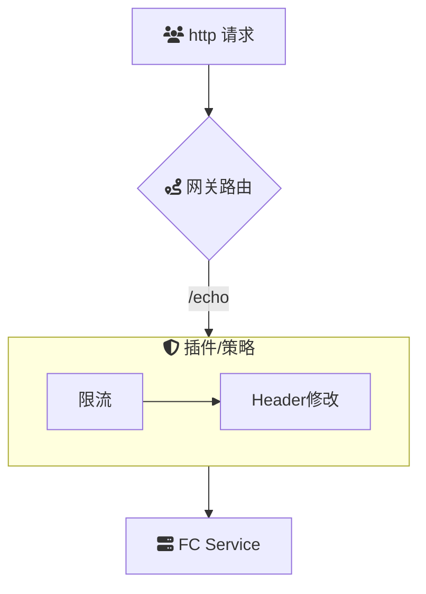

# intro
通过云原生 API 网关访问函数计算 FC 函数

## summary

### 场景描述
在现代云计算架构中，应用程序通常由多个微服务组成，这些微服务可能分布在不同的云环境中。函数计算（FC）作为一种无服务器计算服务，允许开发者在无需管理服务器的情况下运行代码。API 网关作为统一的入口，负责路由、认证、限流等功能，将外部请求转发到相应的后端服务。结合这两者，可以实现高效、可扩展的应用架构，适用于各种动态和高并发的业务场景。

### 应用场景
1. **Web 应用后端**：通过 API 网关将前端请求路由到不同的 FC 函数，实现业务逻辑处理、数据处理等功能。
2. **移动应用支持**：为移动应用提供统一的 API 接口，利用 FC 函数进行后台处理，如用户认证、数据同步等。
3. **事件驱动架构**：利用 API 网关触发 FC 函数响应特定事件，实现自动化流程和任务处理。
4. **微服务集成**：在微服务架构中，通过 API 网关管理各服务接口，FC 函数可作为独立的微服务运行业务逻辑。

### 解决问题
1. **统一 API 管理**：通过 API 网关集中管理所有 API 接口，提供统一的认证、授权、监控和限流策略。
2. **提高安全性**：API 网关提供多层安全防护，如 DDoS 防护、身份验证、数据加密等，保障应用安全。

## Architecture

## deploy

## usage