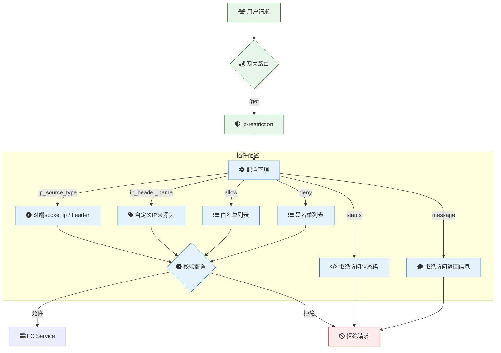

# 概述

**ip-restriction**：IP 访问限制

**ip-restriction** 是一款专为云原生 API 网关设计的插件，旨在通过 IP 地址白名单和黑名单机制，精确控制对服务或路由的访问权限。该插件支持对单个 IP 地址、多个 IP 地址以及类似 `10.10.10.0/24` 的 CIDR 范围进行限制，确保只有经过授权的 IP 地址能够访问指定的资源。通过灵活的配置，**ip-restriction** 能够有效防止未经授权的访问，提升系统的安全性和可靠性。

## 场景描述

在云原生架构中，服务通常暴露在公网或内部网络中，容易受到恶意流量的攻击或未经授权的访问。为了保护关键业务和数据安全，API 网关需要具备强大的访问控制能力，限制特定 IP 地址或 IP 段的访问。**ip-restriction** 插件通过提供 IP 白名单和黑名单功能，帮助开发团队在网关层实现精细化的访问控制，确保只有合法的流量能够到达后端服务。

## 应用场景

### 1. 安全防护与访问控制

- **防止恶意攻击**：通过配置黑名单，阻止已知的恶意 IP 地址或 IP 段访问服务，减少恶意流量对系统的冲击。
- **限制内部访问**：通过配置白名单，确保只有内部网络或特定 IP 地址能够访问敏感服务，防止外部访问。

### 2. 多租户与资源隔离

- **租户 IP 隔离**：根据租户的 IP 地址配置白名单，确保不同租户的资源访问相互隔离，提升多租户环境的安全性。
- **定制化访问控制**：根据不同客户的需求，动态调整 IP 白名单或黑名单，提供定制化的访问控制策略。

### 3. 合规性与审计

- **满足合规要求**：通过 IP 访问控制，确保系统符合特定行业或地区的安全合规要求，如 GDPR、HIPAA 等。
- **审计与监控**：记录被阻止的 IP 访问请求，便于进行安全审计和监控，及时发现和处理潜在的安全威胁。

### 4. 服务保护与流量管理

- **保护关键服务**：通过 IP 白名单限制对关键服务的访问，确保只有授权用户或系统能够访问，防止服务被滥用或攻击。
- **流量优化**：通过 IP 黑名单过滤掉无效或恶意流量，减少后端服务的负载，优化系统性能。

### 5. 环境隔离与测试

- **测试环境隔离**：通过 IP 白名单限制对测试环境的访问，确保只有开发或测试人员能够访问，防止生产环境受到影响。
- **灰度发布支持**：结合流量标记，对特定 IP 地址进行灰度发布，逐步验证新功能或版本的效果。

### 6. 应急响应与故障处理

- **快速阻断攻击**：在发现恶意流量或攻击时，通过快速配置 IP 黑名单，及时阻断攻击，保护系统安全。
- **故障隔离**：在系统出现故障时，通过 IP 白名单限制访问，减少故障对用户的影响，便于快速排查和修复问题。

## 解决问题

- **提升系统安全性**：通过 IP 白名单和黑名单机制，防止未经授权的访问，减少恶意流量对系统的威胁，增强系统的安全性。
- **精细化访问控制**：支持对单个 IP 地址、多个 IP 地址和 CIDR 范围的限制，实现精细化的访问控制，满足不同场景的需求。
- **简化安全管理**：将访问控制逻辑下沉到 API 网关层，避免在后端服务中重复实现，降低安全管理的复杂性和成本。
- **支持合规要求**：通过 IP 访问控制，确保系统符合特定行业或地区的安全合规要求，避免法律和合规风险。
- **优化系统性能**：通过过滤无效或恶意流量，减少后端服务的负载，提高系统的响应速度和资源利用效率。
- **快速响应安全事件**：在发现安全威胁时，能够快速配置 IP 黑名单，及时阻断攻击，提升应急响应能力。
- **支持多租户与定制化服务**：根据租户或客户的需求，动态调整 IP 白名单或黑名单，提供定制化的访问控制策略，提升服务的灵活性和适应性。
- **增强监控与审计能力**：记录被阻止的 IP 访问请求，便于进行安全审计和监控，及时发现和处理潜在的安全威胁，提升系统的可管理性。

## 架构



本示例 `ip-restriction` 插件的配置如下：

> 更多配置详情，请查阅[Github 文档](https://github.com/alibaba/higress/blob/main/plugins/wasm-go/extensions/ip-restriction/README.md)

### 对端 socket ip 配置

```yaml
ip_source_type: origin-source
deny:
  - 140.205.11.250
```

#### 获取对端 socket ip

```yaml
curl ifconfig.me
```

1. 将客户端的 IP 配置在 `allow`(白名单) 中请求时

```
curl -iv 'http://env-cu9g82mm1hkui0vcv5eg-cn-hangzhou.alicloudapi.com/get'
```

预期返回结果：

```
{
  "args": {},
  "headers": {
    "Accept": "*/*",
    "Accept-Encoding": "gzip",
    "Host": "ip-restlugin-fo-wuovfhrffi.cn-hangzhou-vpc.fcapp.run",
    "Original-Host": "env-cu9g82mm1hkui0vcv5eg-cn-hangzhou.alicloudapi.com",
    "Req-Start-Time": "1739437193599",
    "User-Agent": "curl/7.86.0",
    "X-Envoy-Attempt-Count": "1",
    "X-Envoy-External-Address": "140.205.11.250",
    "X-Envoy-Original-Host": "env-cu9g82mm1hkui0vcv5eg-cn-hangzhou.alicloudapi.com",
    "X-Envoy-Route-Identifier": "true",
    "X-Fc-Access-Key-Id": "",
    "X-Fc-Access-Key-Secret": "",
    "X-Fc-Account-Id": "1419633767709936",
    "X-Fc-Api-Server-Ip": "",
    "X-Fc-Base-Path": "/get",
    "X-Fc-Client-Ip": "",
    "X-Fc-Control-Path": "/http-invoke",
    "X-Fc-Eagleeye-Rpcid": "",
    "X-Fc-Eagleeye-Traceid": "",
    "X-Fc-Eagleeye-Userdata": "",
    "X-Fc-Function-Handler": "index.handler",
    "X-Fc-Function-Memory": "1024",
    "X-Fc-Function-Name": "ip-restriction-plugin-f47o",
    "X-Fc-Function-Timeout": "3",
    "X-Fc-Qualifier": "LATEST",
    "X-Fc-Region": "cn-hangzhou",
    "X-Fc-Request-Id": "1-67adb489-15d49184-2d4fa002fa2b",
    "X-Fc-Retry-Count": "0",
    "X-Fc-Security-Token": "",
    "X-Fc-Service-Logproject": "",
    "X-Fc-Service-Logstore": "",
    "X-Fc-Service-Name": "",
    "X-Fc-Tracing-Jaeger-Endpoint": "",
    "X-Fc-Tracing-Opentracing-Span-Baggages": "",
    "X-Fc-Tracing-Opentracing-Span-Context": "",
    "X-Fc-Version-Id": ""
  },
  "origin": "140.205.11.250, 100.117.33.12",
  "url": "http,http://ip-restlugin-fo-wuovfhrffi.cn-hangzhou-vpc.fcapp.run/get"
}
```

2. 将客户端的 IP 配置在 `deny`(黑名单) 中请求时

```
curl -iv 'http://env-cu9g82mm1hkui0vcv5eg-cn-hangzhou.alicloudapi.com/get'
```

预期返回结果：

```
<!-- 返回内容可通过 message 配置 -->
Your IP address is blocked.
```

### 通过 header 配置

```yaml
ip_source_type: header
ip_header_name: x-real-iP
deny:
  - 10.0.0.1
```

1. 将客户端的 IP 配置在 `allow`(白名单) 中请求时

```
curl -iv 'http://env-cu9g82mm1hkui0vcv5eg-cn-hangzhou.alicloudapi.com/get' -H 'x-real-iP: 10.0.0.1'
```

预期返回结果：

```
{
  "args": {},
  "headers": {
    "Accept-Encoding": "gzip",
    "Host": "ip-restlugin-fo-wuovfhrffi.cn-hangzhou-vpc.fcapp.run",
    "Original-Host": "env-cu9g82mm1hkui0vcv5eg-cn-hangzhou.alicloudapi.com",
    "Req-Start-Time": "1739437563163",
    "User-Agent": "Go-http-client/1.1",
    "X-Envoy-Attempt-Count": "1",
    "X-Envoy-Internal": "true",
    "X-Envoy-Original-Host": "env-cu9g82mm1hkui0vcv5eg-cn-hangzhou.alicloudapi.com",
    "X-Envoy-Route-Identifier": "true",
    "X-Fc-Access-Key-Id": "",
    "X-Fc-Access-Key-Secret": "",
    "X-Fc-Account-Id": "1419633767709936",
    "X-Fc-Api-Server-Ip": "",
    "X-Fc-Base-Path": "/get",
    "X-Fc-Client-Ip": "",
    "X-Fc-Control-Path": "/http-invoke",
    "X-Fc-Eagleeye-Rpcid": "",
    "X-Fc-Eagleeye-Traceid": "",
    "X-Fc-Eagleeye-Userdata": "",
    "X-Fc-Function-Handler": "index.handler",
    "X-Fc-Function-Memory": "1024",
    "X-Fc-Function-Name": "ip-restriction-plugin-f47o",
    "X-Fc-Function-Timeout": "3",
    "X-Fc-Qualifier": "LATEST",
    "X-Fc-Region": "cn-hangzhou",
    "X-Fc-Request-Id": "1-67adb5fb-15d42ca1-4b78982c9e43",
    "X-Fc-Retry-Count": "0",
    "X-Fc-Security-Token": "",
    "X-Fc-Service-Logproject": "",
    "X-Fc-Service-Logstore": "",
    "X-Fc-Service-Name": "",
    "X-Fc-Tracing-Jaeger-Endpoint": "",
    "X-Fc-Tracing-Opentracing-Span-Baggages": "",
    "X-Fc-Tracing-Opentracing-Span-Context": "",
    "X-Fc-Version-Id": ""
  },
  "origin": "172.16.0.56, 100.117.33.237",
  "url": "http,http://ip-restlugin-fo-wuovfhrffi.cn-hangzhou-vpc.fcapp.run/get"
}
```

2. 将客户端的 IP 配置在 `deny`(黑名单) 中请求时

```
curl -iv 'http://env-cu9g82mm1hkui0vcv5eg-cn-hangzhou.alicloudapi.com/get' -H 'x-real-iP: 10.0.0.1'
```

预期返回结果：

```
<!-- 返回内容可通过 message 配置 -->
Your IP address is blocked.
```
