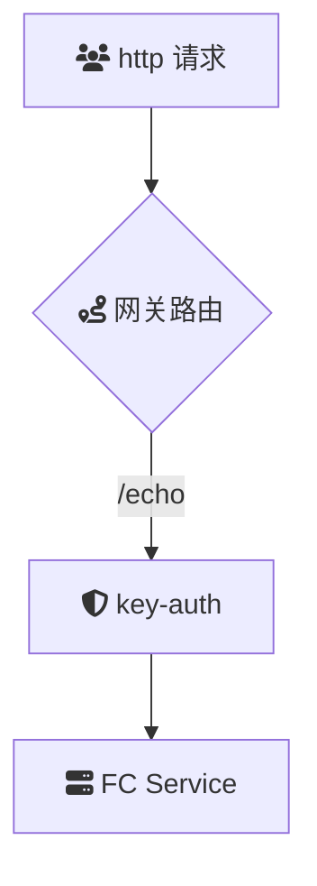

# Intro

**key-auth** 插件为云原生 API 网关提供了基于 API Key 的认证和权限控制功能。通过从 HTTP 请求的 URL 参数或请求头中提取 API Key，并验证其有效性和权限，该插件确保了 API 资源的安全访问。插件支持灵活的配置选项，允许管理员定义 API Key 的生成、分发和验证机制，适应不同的业务需求和安全策略。

## Summary

### 场景描述

在微服务架构和分布式系统中，API 网关作为统一的入口点，承担着认证、鉴权、流量控制等关键职责。随着 API 的广泛应用，确保 API 的安全访问变得尤为重要。传统的认证方法可能难以满足高效、灵活的认证需求，而基于 API Key 的认证机制因其简单性和易于管理性，成为许多企业的首选。**key-auth** 插件应运而生，通过提供可靠的 API Key 认证功能，帮助企业保护其 API 资源，防止未经授权的访问和滥用。

### 应用场景

1. **API 访问控制**：

   - **企业内部 API**：确保只有授权的内部应用和服务能够访问企业内部的 API，保护敏感数据和业务逻辑。
   - **第三方 API 服务**：为外部合作伙伴和开发者提供受控访问权限，防止未经授权的使用和流量滥用。

2. **SaaS 应用**：

   - **多租户环境**：为不同租户分配唯一的 API Key，实现租户间的访问隔离和权限管理。
   - **API 配额管理**：根据租户的订阅等级，分配不同的 API 使用配额，控制资源消耗。

3. **移动和前端应用**：

   - **移动应用授权**：为移动端应用分配专属 API Key，管理其访问权限和使用限制。
   - **单页应用（SPA）**：保护前端应用调用的后端 API，防止未经授权的访问和数据泄露。

4. **合作伙伴和开发者门户**：

   - **开发者注册和管理**：通过 key-auth 插件，管理开发者的 API Key，控制其访问权限和流量使用。
   - **合作伙伴集成**：为业务合作伙伴分配专用 API Key，确保其对特定 API 的访问权限和安全性。

5. **物联网（IoT）设备**：

   - **设备认证**：为每个 IoT 设备分配唯一的 API Key，确保设备与服务器之间的安全通信。
   - **访问控制**：根据设备类型和功能，定义不同的 API Key 权限，防止设备滥用和数据泄露。

6. **内容分发和第三方服务**：
   - **内容 API**：通过 API Key 控制内容分发服务的访问权限，保护内容数据的安全和完整性。
   - **第三方集成**：为第三方服务提供受控访问权限，确保其只能访问特定的 API 端点和功能。

### 解决问题

- **提升 API 安全性**：
  通过验证 API Key 的有效性和权限，确保只有授权的客户端能够访问受保护的 API 资源，防止未经授权的访问和数据泄露。

- **简化认证流程**：
  提供简单易用的 API Key 认证机制，减少复杂的认证流程和多重认证步骤，提高系统的响应速度和用户体验。

- **细粒度权限控制**：
  允许根据不同的 API Key 为客户端分配不同的访问权限和使用配额，实现精细化的权限管理，满足多样化的业务需求。

- **易于管理和维护**：
  支持 API Key 的生成、分发、撤销和更新，提供集中化的管理接口，简化 API Key 的生命周期管理，降低运维复杂性。

- **支持多种应用场景**：
  通过灵活的配置选项，适应不同的业务场景和应用需求，无论是内部 API、第三方服务还是物联网设备，都能够高效地进行认证和权限控制。

- **增强审计与监控**：
  记录和跟踪 API Key 的使用情况和访问行为，提供详细的审计日志和监控数据，帮助企业进行安全审查和流量分析。

- **防止流量滥用和攻击**：
  通过 API Key 限流和配额管理，防止单一或多个客户端过度消耗资源，减轻系统负载，防御拒绝服务（DoS）攻击等威胁。

## Architecture



本示例`key-auth`插件的配置如下：

> 更多配置详情，请查阅[Github 文档](https://github.com/alibaba/higress/blob/main/plugins/wasm-go/extensions/key-auth/README.md)

```
consumers:
	- credential: 2bda943c-ba2b-11ec-ba07-00163e1250b5
		name: consumer1
	keys:
	- x-api-key
```

## deploy

## usage

1. 发起未经鉴权的请求
   首先，尝试不带任何鉴权信息发起请求：

```
curl -iv env-cu9g82mm1hkui0vcv5eg-cn-hangzhou.alicloudapi.com/get
```

预期返回结果：

```
HTTP/1.1 401 Unauthorized
```

说明：
返回 401 Unauthorized 表示未提供有效的鉴权信息，访问被拒绝。

2. 发起带鉴权 Header 的请求
   为确保请求通过鉴权，请在请求头中添加 x-api-key。以下是示例命令：

```
curl -iv -H "x-api-key:2bda943c-ba2b-11ec-ba07-00163e1250b5" env-cu9g82mm1hkui0vcv5eg-cn-hangzhou.alicloudapi.com/get
```

预期返回结果：

```
{
  "args": {},
  "headers": {
    "Accept": "*/*",
    "Accept-Encoding": "gzip",
    "Host": "key-autlugin-eb-cxjqtcveqb.cn-hangzhou-vpc.fcapp.run",
    "Original-Host": "env-cu9g82mm1hkui0vcv5eg-cn-hangzhou.alicloudapi.com",
    "Req-Start-Time": "1738167625960",
    "User-Agent": "curl/8.6.0",
    "X-Api-Key": "2bda943c-ba2b-11ec-ba07-00163e1250b5",
    "X-Envoy-Attempt-Count": "1",
    "X-Envoy-External-Address": "183.157.254.75",
    "X-Envoy-Original-Host": "env-cu9g82mm1hkui0vcv5eg-cn-hangzhou.alicloudapi.com",
    "X-Mse-Consumer": "consumer1"
		...
  },
  "origin": "183.157.254.75, 100.117.33.90",
  "url": "http,http://key-autlugin-eb-cxjqtcveqb.cn-hangzhou-vpc.fcapp.run/get"
}
```

关键点说明：

鉴权成功标识：返回头部中的 X-Mse-Consumer: consumer1 表明 key-auth 插件已成功识别并认证调用者名称为 consumer1。
请求详情：响应中包含了原始请求的详细信息，帮助您验证请求路径和源地址等信息。 3. 注意事项
API 密钥：确保使用的 x-api-key 与网关配置中的密钥匹配。
请求 URL：使用正确的网关实例域名发起请求，避免拼写错误。
安全性：请妥善保管您的 API 密钥，避免泄露。
