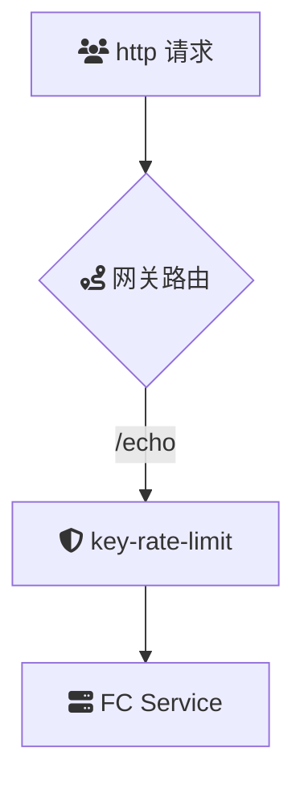

# Intro
**key-rate-limit**：基于 Key 的本地限流插件

## Summary
### 场景描述
**key-rate-limit** 插件实现了基于特定键值的限流机制，键值来源可配置为 URL 参数、HTTP 请求头等多种方式。通过对不同的键进行独立的请求计数和限流控制，确保 API 服务在高并发环境下的稳定性和可用性。

### 应用场景
1. **按用户限流**：针对不同用户的 API 调用进行独立的限流，防止单一用户的高频请求影响其他用户的服务体验。
2. **按 API Key 限流**：针对不同的 API Key 设置不同的限流策略，确保各个客户端应用在其配额范围内稳定运行。
4. **按订单或交易 ID 限流**：针对特定业务场景，如订单处理，控制并发请求的数量，确保业务流程的顺畅。
5. **动态限流策略**：根据实时的业务需求动态调整限流参数，如在促销活动期间增加流量允许量。

### 解决问题
- **细粒度流量控制**：通过基于键值的限流，实现对不同请求来源的独立控制，避免资源争用和服务雪崩。
- **灵活的配置支持**：支持多种键值来源配置，适应不同的业务需求和场景变化，提升限流策略的适应性。
- **提高系统稳定性**：有效防止高并发请求导致的服务过载，保障 API 服务的高可用性和响应速度。
- **防护恶意请求**：通过精准限流，减少恶意爬虫、DDoS 攻击等对服务的冲击，提升整体安全性。

## Architecture

## deploy

## usage