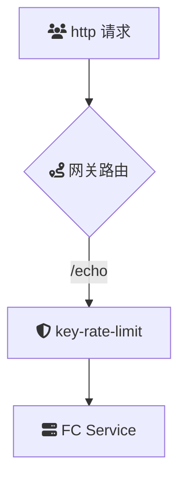

# 概述
key-rate-limit 插件实现了基于特定键值的限流功能，键值来源可以是 URL 参数、HTTP 请求头等。通过灵活的键值提取策略，该插件能够为不同的请求提供差异化的限流能力，从而有效保护后端服务免受过载或滥用。

### 场景描述
当系统需要针对不同业务维度的请求特征实施差异化限流时，典型场景包括：
- 电商秒杀场景按用户ID限制商品购买频率
- API网关根据客户端IP限制敏感接口调用频次
- SaaS平台按租户ID保障多租户间的资源隔离
- 需要防止攻击者通过特定URL参数进行接口探测的场景

### 应用场景
1. **客户端分级控制** - 通过`X-API-Key`请求头区分客户端类型，为不同等级客户设置差异化的QPS
2. **用户行为管控** - 基于`user_id`参数限制单个用户的评论提交频率（如5次/分钟）
3. **地理区域限流** - 使用`X-Geo-Country`头对国家代码实施阶梯式流量控制
4. **资源防护** - 针对`/download`接口的`file_id`参数，防止单个文件被高频恶意下载
5. **设备指纹防控** - 通过`X-Device-Fingerprint`头识别异常设备，实施熔断式限流

### 解决问题
1. **细粒度控制缺失** - 传统网关级限流无法区分请求特征，本插件支持到键值维度的精准控制
2. **热点资源防护** - 防止单一键值（如热门商品ID）被高频访问导致服务雪崩
3. **业务维度隔离** - 基于租户/用户等业务标识实现资源隔离，避免异常流量跨维度扩散
4. **动态攻击防御** - 对抗通过URL参数旋转进行的CC攻击（如不同`proxy_id`的轮询攻击）
5. **多层级配额管理** - 支持在全局速率限制下叠加键值级子配额，实现分层流量管控
6. **弹性容量规划** - 通过键值维度流量分析，识别热点数据并指导容量扩缩容

## 架构

## 部署

## usage