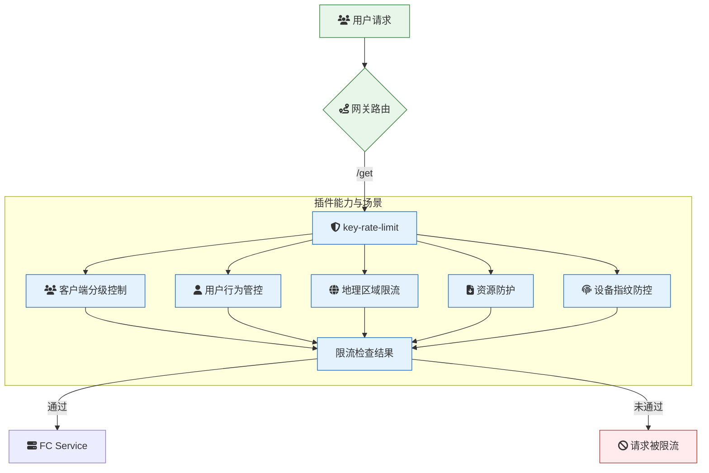

# 概述

key-rate-limit 插件实现了基于特定键值的限流功能，键值来源可以是 URL 参数、HTTP 请求头等。通过灵活的键值提取策略，该插件能够为不同的请求提供差异化的限流能力，从而有效保护后端服务免受过载或滥用。

### 场景描述

当系统需要针对不同业务维度的请求特征实施差异化限流时，典型场景包括：

- 电商秒杀场景按用户 ID 限制商品购买频率
- API 网关根据客户端 IP 限制敏感接口调用频次
- SaaS 平台按租户 ID 保障多租户间的资源隔离
- 需要防止攻击者通过特定 URL 参数进行接口探测的场景

### 应用场景 

1. **客户端分级控制** - 通过`X-API-Key`请求头区分客户端类型，为不同等级客户设置差异化的 QPS
2. **用户行为管控** - 基于`user_id`参数限制单个用户的评论提交频率（如 5 次/分钟）
3. **地理区域限流** - 使用`X-Geo-Country`头对国家代码实施阶梯式流量控制
4. **资源防护** - 针对`/download`接口的`file_id`参数，防止单个文件被高频恶意下载
5. **设备指纹防控** - 通过`X-Device-Fingerprint`头识别异常设备，实施熔断式限流

### 解决问题

1. **细粒度控制缺失** - 传统网关级限流无法区分请求特征，本插件支持到键值维度的精准控制
2. **热点资源防护** - 防止单一键值（如热门商品 ID）被高频访问导致服务雪崩
3. **业务维度隔离** - 基于租户/用户等业务标识实现资源隔离，避免异常流量跨维度扩散
4. **动态攻击防御** - 对抗通过 URL 参数旋转进行的 CC 攻击（如不同`proxy_id`的轮询攻击）
5. **多层级配额管理** - 支持在全局速率限制下叠加键值级子配额，实现分层流量管控
6. **弹性容量规划** - 通过键值维度流量分析，识别热点数据并指导容量扩缩容

## 架构



本示例`key-rate-limit`插件的配置如下：

> 更多配置详情，请查阅[Github 文档](https://github.com/alibaba/higress/blob/main/plugins/wasm-cpp/extensions/key_rate_limit/README.md)

### 识别请求参数 apikey，进行区别限流

```yaml
limit_by_param: apikey
limit_keys:
  - key: 9a342114-ba8a-11ec-b1bf-00163e1250b5
    query_per_second: 10
```

1. 发起未经流量管控的请求
   首先，尝试不带任何流量管控信息发起请求：

```
curl -iv 'http://env-cu9g82mm1hkui0vcv5eg-cn-hangzhou.alicloudapi.com/get'
```

预期返回结果：

```
{
  "args": {
    "apikey": "9a342114-ba8a-11ec-b1bf-00163e1250b5"
  },
  "headers": {
    "Accept-Encoding": "gzip",
    "Host": "key-ratugin-pul-ccdnjmacrw.cn-hangzhou-vpc.fcapp.run",
    "Original-Host": "env-cu9g82mm1hkui0vcv5eg-cn-hangzhou.alicloudapi.com",
    "Req-Start-Time": "1738907445473",
    "User-Agent": "Go-http-client/1.1",
    "X-Envoy-Attempt-Count": "1",
    "X-Envoy-Internal": "true",
    "X-Envoy-Original-Host": "env-cu9g82mm1hkui0vcv5eg-cn-hangzhou.alicloudapi.com",
    "X-Envoy-Route-Identifier": "true",
    "X-Fc-Access-Key-Id": "",
    "X-Fc-Access-Key-Secret": "",
    "X-Fc-Account-Id": "1419633767709936",
    "X-Fc-Api-Server-Ip": "",
    "X-Fc-Base-Path": "/get",
    "X-Fc-Client-Ip": "",
    "X-Fc-Control-Path": "/http-invoke",
    "X-Fc-Eagleeye-Rpcid": "",
    "X-Fc-Eagleeye-Traceid": "",
    "X-Fc-Eagleeye-Userdata": "",
    "X-Fc-Function-Handler": "index.handler",
    "X-Fc-Function-Memory": "1024",
    "X-Fc-Function-Name": "key-rate-limit-plugin-1pul",
    "X-Fc-Function-Timeout": "3",
    "X-Fc-Qualifier": "LATEST",
    "X-Fc-Region": "cn-hangzhou",
    "X-Fc-Request-Id": "1-67a59f35-150c1267-f381ba1c085c",
    "X-Fc-Retry-Count": "0",
    "X-Fc-Security-Token": "",
    "X-Fc-Service-Logproject": "",
    "X-Fc-Service-Logstore": "",
    "X-Fc-Service-Name": "",
    "X-Fc-Tracing-Jaeger-Endpoint": "",
    "X-Fc-Tracing-Opentracing-Span-Baggages": "",
    "X-Fc-Tracing-Opentracing-Span-Context": "",
    "X-Fc-Version-Id": ""
  },
  "origin": "172.16.37.65, 100.117.33.29",
  "url": "http,http://key-ratugin-pul-ccdnjmacrw.cn-hangzhou-vpc.fcapp.run/get?apikey=9a342114-ba8a-11ec-b1bf-00163e1250b5"
}
```

2. 发起带流量管控 Query 参数的请求
   为确保请求时触发限流管控，请在请求地址中添加 apikey 参数。以下是示例命令：

```
curl -iv 'http://env-cu9g82mm1hkui0vcv5eg-cn-hangzhou.alicloudapi.com/get?apikey=9a342114-ba8a-11ec-b1bf-00163e1250b5'
```

预期返回结果：

```
rate_limited
```

### 识别请求头 x-ca-key，进行区别限流

```yaml
limit_by_header: x-ca-key
limit_keys:
  - key: 102234
    query_per_second: 10
```

1. 发起未经流量管控的请求
   首先，尝试不带任何流量管控信息发起请求：

```
curl -iv 'http://env-cu9g82mm1hkui0vcv5eg-cn-hangzhou.alicloudapi.com/get'
```

预期返回结果：

```
{
  "args": {},
  "headers": {
    "Accept": "*/*",
    "Accept-Encoding": "gzip",
    "Host": "key-ratgin-fmic-ncdnjmvpru.cn-hangzhou-vpc.fcapp.run:80",
    "Original-Host": "env-cu9g82mm1hkui0vcv5eg-cn-hangzhou.alicloudapi.com",
    "Req-Start-Time": "1738828590263",
    "User-Agent": "curl/7.86.0",
    "X-Ca-Key": "102234",
    "X-Envoy-Attempt-Count": "1",
    "X-Envoy-External-Address": "140.205.11.250",
    "X-Envoy-Original-Host": "env-cu9g82mm1hkui0vcv5eg-cn-hangzhou.alicloudapi.com",
    "X-Envoy-Route-Identifier": "true",
    "X-Fc-Access-Key-Id": "",
    "X-Fc-Access-Key-Secret": "",
    "X-Fc-Account-Id": "1419633767709936",
    "X-Fc-Api-Server-Ip": "",
    "X-Fc-Base-Path": "/get",
    "X-Fc-Client-Ip": "",
    "X-Fc-Control-Path": "/http-invoke",
    "X-Fc-Eagleeye-Rpcid": "",
    "X-Fc-Eagleeye-Traceid": "",
    "X-Fc-Eagleeye-Userdata": "",
    "X-Fc-Function-Handler": "index.handler",
    "X-Fc-Function-Memory": "1024",
    "X-Fc-Function-Name": "key-rate-limit-plugin-fmic",
    "X-Fc-Function-Timeout": "3",
    "X-Fc-Qualifier": "LATEST",
    "X-Fc-Region": "cn-hangzhou",
    "X-Fc-Request-Id": "1-67a46b2e-15de0407-cbb76138ab7f",
    "X-Fc-Retry-Count": "0",
    "X-Fc-Security-Token": "",
    "X-Fc-Service-Logproject": "",
    "X-Fc-Service-Logstore": "",
    "X-Fc-Service-Name": "",
    "X-Fc-Tracing-Jaeger-Endpoint": "",
    "X-Fc-Tracing-Opentracing-Span-Baggages": "",
    "X-Fc-Tracing-Opentracing-Span-Context": "",
    "X-Fc-Version-Id": ""
  },
  "origin": "140.205.11.250, 100.117.33.237",
  "url": "http,http://key-ratgin-fmic-ncdnjmvpru.cn-hangzhou-vpc.fcapp.run/get"
}
```

2. 发起带流量管控 Header 的请求
   为确保请求时触发限流管控，请在请求头中添加 x-ca-key。以下是示例命令：

```
curl -iv 'http://env-cu9g82mm1hkui0vcv5eg-cn-hangzhou.alicloudapi.com/get' -H 'x-ca-key: 102234'
```

预期返回结果：

```
rate_limited
```

### 关键点说明：

1. 触发限流管控的成功标识：返回的内容为 rate_limited。
2. 触发限流管控的条件：需要请求次数超过所配置时段的次数。
