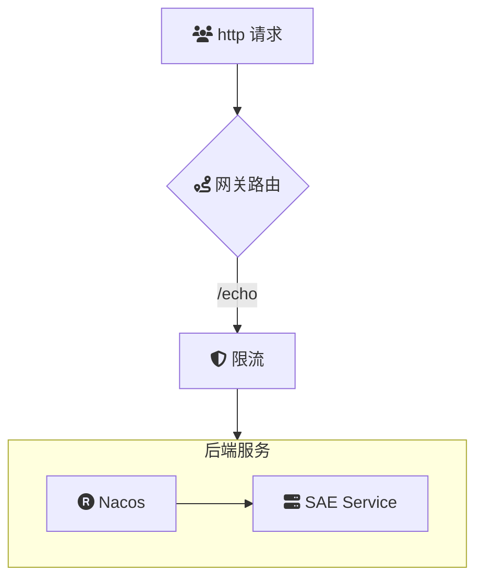

# intro
云原生API网关管理 Nacos中的服务
云原生API网关作为系统架构的入口，将传统的流量网关与微服务网关功能集成于一体。这种融合不仅显著降低了网络开销和运维成本，还提供了丰富的流量治理能力，包括负载均衡、动态路由、熔断降级、限流等。通过与Nacos的深度集成，API网关能够实时感知服务的动态变化，实现高效的服务管理与调度，确保系统的高可用性与弹性扩展。

## summary
### 场景描述
在现代微服务架构中，应用通常由多个独立部署的服务组成，这些服务需要高效、可靠地进行通信与协作。传统的流量管理方式难以应对复杂的服务依赖关系和动态变化的服务实例，导致网络开销增加、运维复杂度提升以及服务治理能力不足。此外，随着业务的不断发展，系统对流量控制、访问安全和监控能力的需求也日益增长，迫切需要一种统一、高效的解决方案来优化流量管理和服务治理。

### 应用场景
1. **微服务架构**：在基于微服务的应用中，API网关作为所有外部请求的统一入口，负责请求的路由、负载均衡、认证授权等功能，简化了服务间的通信和管理。
2. **多集群与多区域部署**：在跨区域或多集群的部署环境中，API网关能够统一管理不同区域的服务注册与发现，确保跨区域的流量高效路由与调度。
3. **高可用与弹性扩展**：	通过与Nacos的集成，API网关能够实时监控服务实例的健康状态，实现自动化的服务发现与故障切换，提升系统的整体可用性和弹性。
4. **流量治理与安全防护**：在需要精细化流量控制和安全防护的场景中，API网关提供了丰富的策略配置，如限流、熔断、IP白名单等，确保系统在高并发和恶意攻击下依然稳定运行。
### 解决问题
1. **简化服务管理**：通过集成Nacos，API网关自动获取最新的服务注册信息，避免了手动配置和更新，提高了服务管理的效率和准确性。
2. **降低网络开销**：将传统流量网关与微服务网关功能统一，使得流量可以在同一层面进行管理，减少了网络跳转和冗余配置，降低了整体网络开销。
3. **提升运维效率**：统一的流量管理和服务发现机制简化了运维流程，减少了维护成本，同时通过可视化的监控和日志，实现对系统运行状态的全面掌控。
4. **增强流量治理能力**：提供全面的流量控制策略，包括动态路由、负载均衡、熔断降级、限流等，确保系统在各种流量条件下依然能够稳定、高效地运行。
5. **保障系统安全**：通过API网关的统一入口，实现了对外部访问的统一认证和授权，提升了系统的安全性，同时支持细粒度的访问控制策略，防范潜在的安全威胁。

## Architecture

## deploy

## usage