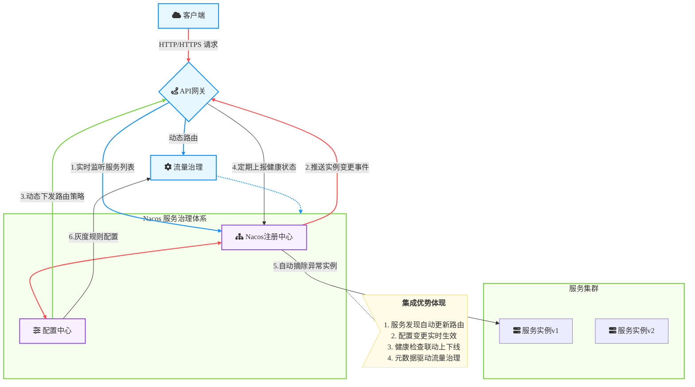

# 概述
云原生API网关管理 Nacos中的服务
云原生网关作为系统架构的入口，将传统的流量网关和微服务网关合二为一，不仅大幅降低了网络开销和运维成本，还提供了丰富的流量治理能力。通过与Nacos（动态服务发现/配置管理平台）深度集成，实现了服务路由的动态感知与实时生效，构建了完整的服务治理闭环。

### 场景描述
在云原生微服务架构中，服务实例的动态注册/发现和弹性扩缩是核心特征。传统网关方案需手动维护路由配置，难以适应服务拓扑的频繁变化。通过云原生API网关与Nacos的协同，可实现：1) 自动同步Nacos注册中心的服务元数据；2) 基于服务名的智能路由；3) 实时响应服务实例上下线事件；4) 结合配置中心的动态策略生效。典型拓扑中，网关作为统一入口对接Nacos服务目录，根据实时服务状态执行路由决策。

### 应用场景
1. **多环境服务路由**：通过Nacos命名空间/分组机制，实现开发、测试、生产环境的自动流量隔离
2. **灰度发布控制**：基于Nacos元数据标签，实施基于版本号的AB测试和金丝雀发布
3. **弹性流量调度**：根据Nacos健康检查状态，自动剔除异常实例并分发流量到健康节点
4. **服务聚合与协议转换**：将Nacos注册的gRPC/Dubbo服务自动转换为RESTful API
5. **混合云流量治理**：对接多个Nacos集群实现跨云服务的统一路由管理
### 解决问题
1. **服务发现与网关解耦**：消除传统架构中需要双重注册（服务注册中心+网关配置）的冗余操作
2. **配置同步延迟**：通过监听Nacos配置变更事件（Watch机制），实现路由规则秒级生效
3. **动态治理能力缺失**：支持基于Nacos服务元数据的动态流量染色、权重调整、熔断降级
4. **运维复杂度高**：自动生成SwaggerAPI文档（基于Nacos服务元数据），降低OpenAPI维护成本
5. **安全策略统一**：联动Nacos的CMDB数据，实现基于服务标签的细粒度访问控制（IP黑白名单、RBAC）
6. **可观测性增强**：通过Nacos服务心跳数据与网关Metrics联动，构建服务健康度->流量变化->异常告警的监控链路

## 架构

## 部署

## usage