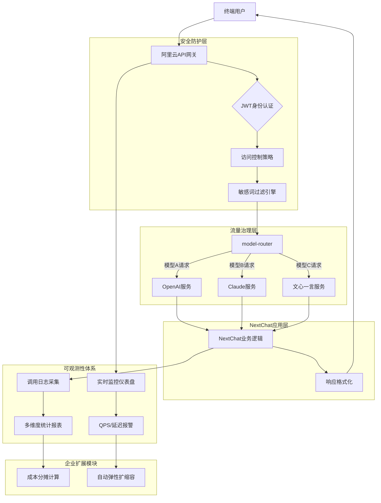

# 概述
一键部署您的企业级 ChatGPT 应用，支持多模型适配，AI 安全防护，AI 统计等企业级特性。使得 AI 与网关的集成更加便捷和高效。详情请查看[ChatGPT Next Web 官网](https://github.com/ChatGPTNextWeb/ChatGPT-Next-Web)。

### 场景描述
1. **企业级AI服务快速搭建**：通过阿里云API网关与NextChat的无缝集成，实现15分钟完成从代码到生产环境的完整AI服务部署
2. **全链路安全增强**：在API网关层构建身份认证、访问控制、敏感词过滤三道防线，保障LLM交互内容合规性
3. **智能流量治理**：基于API网关的智能路由策略，实现多AI模型的动态负载均衡与故障自动转移
4. **深度观测能力**：通过网关层可观测性体系实时监控AI服务质量（QPS、响应延迟、错误率），提供多维度用量统计报表

### 应用场景
1. **企业知识库智能助手**：集成私有化部署的LLM模型，构建具备领域知识库的智能问答系统，通过API网关实现员工统一访问入口
2. **多模型协同服务**：同时对接OpenAI/Claude/文心一言等多个AI引擎，通过网关路由策略实现智能模型选择与流量分配
3. **全球化AI服务部署**：利用阿里云全球加速能力，为不同地域用户提供低延迟的AI服务访问，同时满足数据本地化合规要求
4. **安全合规场景**：在金融/医疗等敏感行业，通过网关层的敏感信息过滤和审计日志，确保AI交互内容符合行业监管规范

### 解决问题
1. **部署复杂度高**：通过标准OpenAPI协议封装，消除AI服务与传统业务系统对接的协议转换成本
2. **安全防护薄弱**：提供企业级WAF防护、JWT身份鉴权、流量限流熔断三位一体安全方案，防御AI服务面临的注入攻击与API滥用风险
3. **运维难度大**：内置智能运维套件，自动生成API调用拓扑图，实时告警异常流量模式（如突发性高并发请求）
4. **成本不可控**：基于API网关的精细化流量分析，实现AI模型调用成本的分摊计量，支持按部门/项目/应用的细粒度成本核算
5. **扩展能力不足**：通过弹性实例自动扩缩容机制，支持单日亿级AI请求处理，保障大促/营销活动期间的服务稳定性

## 架构
