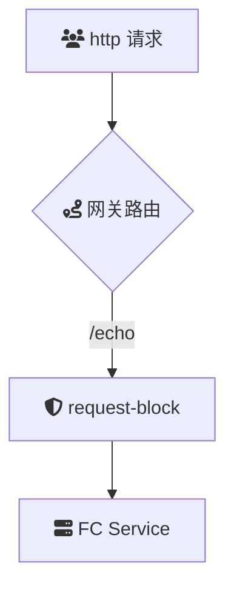

# 概述
**request-block** 是一款用于云原生 API 网关的请求屏蔽插件，通过基于 URL、请求头等特征对 HTTP 请求进行筛选和屏蔽。该插件可用于防护站点资源不被非法访问或暴露，提升系统的安全性和可靠性。

### 场景描述
在现代 Web 应用和微服务架构中，API 网关作为流量入口，需要有效过滤和管理大量的 HTTP 请求。部分资源可能不适合公开暴露，如内部管理接口、开发调试工具等。未经筛选的请求可能导致资源滥用、数据泄露或服务被攻击。因此，具备强大的请求屏蔽能力对于保护系统安全和维护服务健康至关重要。

### 应用场景
1. **保护敏感资源**：屏蔽对内部管理接口、配置接口等敏感资源的外部访问，只允许授权请求通过。
2. **防止恶意攻击**：通过识别和屏蔽来自恶意 IP、恶意 User-Agent 等特征的请求，有效防御 DDoS 攻击、爬虫攻击等。
3. **限制特定用户访问**：基于请求头中的用户标识，如 API Key、Token，限制特定用户或客户端的访问权限。
4. **隐藏后台服务信息**：防止外部用户获取后台服务的详细信息，如服务路径、版本信息等，增强应用的安全性。
5. **流量管理与优化**：屏蔽不必要的流量请求，减轻服务器负载，提高系统的响应效率和稳定性。
6. **遵循合规要求**：根据企业或行业的安全合规标准，屏蔽和管理不符合规定的请求，确保系统运行符合要求。

### 解决问题
- **提升系统安全性**：通过精准屏蔽不合规或恶意的请求，防止潜在的安全威胁和攻击，保障系统的完整性和可用性。
- **保护敏感数据**：阻止未经授权的请求访问敏感资源，避免数据泄露和滥用，维护用户和企业的利益。
- **优化资源利用**：减少不必要的请求流量，降低服务器负载，提升系统的处理效率和用户体验。
- **增强访问控制**：实现细粒度的访问控制策略，根据不同的请求特征制定相应的屏蔽规则，提高访问管理的精度和灵活性。
- **简化运维管理**：提供清晰的配置和日志记录，方便运维人员监控请求流量，调整屏蔽策略，确保系统的稳定运行。
- **支持动态配置**：允许在运行时动态调整屏蔽规则，快速响应安全威胁或业务需求变化，提升系统的适应能力。

## 架构

## 部署

## usage