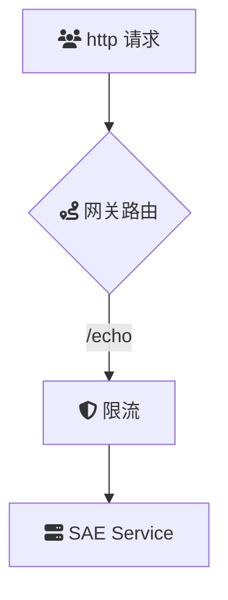

# 概述
HTTP API访问SAE应用里注册的K8s Service

当您需要从外部系统或客户端访问部署在SAE中的服务时，可以通过在云原生API网关中创建HTTP API，从而实现访问SAE里应用提供的服务，提升了服务的可访问性和外部集成能力。

### 场景描述
在现代企业应用架构中，服务通常部署在Kubernetes集群中，并通过Serverless App Engine（SAE）进行管理和扩展。然而，这些内部服务默认情况下仅在集群内部可见，限制了其与外部系统或客户端的直接交互需求。随着业务的发展，外部系统（如移动应用、第三方服务或合作伙伴系统）需要安全、高效地访问这些内部服务，以实现功能集成和数据交换。

### 应用场景
1. **移动应用后端服务**：
	移动端应用需要调用后端API获取数据或执行业务逻辑，通过API网关暴露SAE中的K8s服务，确保移动应用与后端服务的高效通信。
2. **第三方系统集成**：
	企业需要与外部合作伙伴或第三方服务进行数据交换和功能集成，API网关提供统一的入口，简化集成流程并增强安全性。
3. **微服务架构中的服务间通信**：
	在复杂的微服务架构中，API网关充当统一的流量控制层，管理内部服务间的调用，提升系统的可维护性和可扩展性。
4. **多租户环境**：
	对于提供多租户服务的平台，通过API网关可以将不同租户的请求路由到相应的SAE应用，确保数据隔离和安全。

### 解决问题
1. **提升可访问性**：
	通过API网关将内部K8s服务暴露为HTTP API，简化外部系统对SAE应用的访问路径，提升服务的可访问性。
2. **增强安全性**：
	API网关提供了认证、授权、流量限控等安全机制，确保只有合法的请求才能访问SAE中的服务，保护内部系统免受潜在的安全威胁。
3. **弹性伸缩与高可用**：
	API网关能够智能路由请求到多个后端实例，支持负载均衡和故障转移，确保服务在高并发和故障情况下依然稳定可用。
4. **监控与日志管理**：
	集成的监控和日志功能，帮助运维团队实时监控API调用情况，快速定位和解决潜在问题，提升整体系统的可靠性。

## 架构

## 部署

## 使用