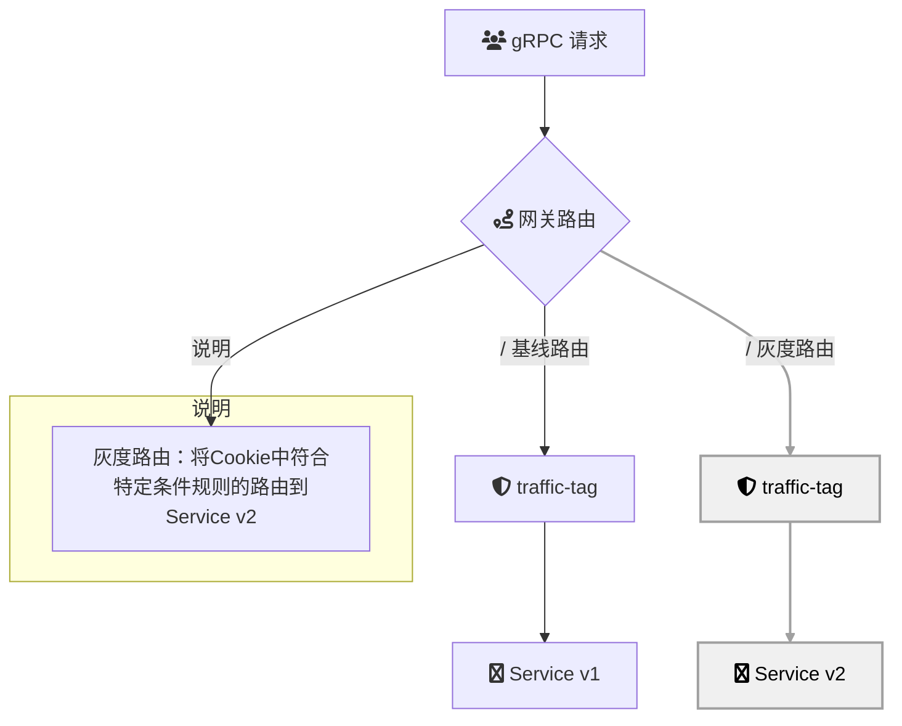

# Intro
**基于云原生 API 网关实现前端灰度**是一种利用云原生 API 网关的流量管理和路由能力，逐步向部分用户发布新版本前端应用或功能的策略。通过灰度发布，开发团队能够在限定范围内测试新功能的稳定性和用户接受度，降低全量发布带来的风险，并收集真实用户反馈以优化产品体验。云原生 API 网关提供了灵活的配置和动态流量控制能力，实现新功能的渐进式上线、A/B 测试和快速回滚，从而支持持续集成与持续部署（CI/CD）的最佳实践。

## Summary
### 场景描述
在快速迭代和持续交付的开发环境中，前端应用的更新频繁，直接全量发布新版本可能导致未知问题影响大量用户，甚至引发服务崩溃或用户流失。为了在保障系统稳定性的前提下引入新功能，前端灰度发布成为一种关键策略。通过灰度发布，开发团队可以将新版本的流量逐步引入，通过监控和反馈验证其性能和用户体验，确保在全面推广前发现并解决潜在问题。云原生 API 网关作为流量管理的核心组件，提供了实现灰度发布所需的功能和灵活性，使得灰度策略能够高效、安全地实施。

### 应用场景
1. **新功能的渐进式上线**：
   - 在引入重大变更或新功能时，先向小部分用户发布，观察其表现和用户反馈，再逐步扩大覆盖范围，确保新功能的稳定性和可接受性。

2. **A/B 测试**：
   - 通过 API 网关将流量分配到不同版本的前端应用，评估不同设计或功能对用户行为和业务指标的影响，支持数据驱动的产品优化决策。

3. **高风险更新的风险控制**：
   - 对涉及安全性或关键业务逻辑的前端更新，采用灰度发布策略，确保新版本在小范围内经过充分验证后再全面铺开，降低潜在风险。

4. **用户分群与个性化体验**：
   - 根据用户属性（如地域、设备类型、用户等级等）动态分配流量，提供个性化的前端内容和功能，提升用户满意度和粘性。

5. **应急回滚机制**：
   - 在发现新版本存在严重问题时，利用 API 网关的流量切换功能，迅速将流量回滚到稳定版本，保障系统的持续可用性。

6. **多版本共存与平滑迁移**：
   - 支持多个前端版本同时运行，通过 API 网关灵活路由，实现平滑的版本迁移，避免服务中断和用户体验波动。

7. **市场推广与区域测试**：
   - 在特定市场或区域先行发布新功能，评估市场反应和运营效果，指导后续的推广策略和资源分配。

### 解决问题
- **降低发布风险**：
  通过逐步引入新版本流量，及时发现和解决问题，避免全量发布带来的系统宕机或用户体验下降。

- **提升用户体验**：
  在灰度发布过程中，根据用户反馈进行快速迭代和优化，确保最终版本能够更好地满足用户需求和期望。

- **支持持续交付**：
  结合 CI/CD 流水线，实现自动化的灰度发布和回滚机制，提高开发和运维的效率，促进快速迭代和持续交付。

- **精细化流量管理**：
  利用 API 网关的流量分配和路由能力，实现对不同用户群体或请求类型的精准控制，支持多样化的灰度策略。

- **实时监控与反馈**：
  集成监控和日志系统，实时跟踪灰度发布的效果和系统健康状况，提供及时的数据支持和决策依据。

- **增强系统稳定性**：
  通过分阶段发布和动态调整，确保系统资源在不同版本间合理分配，避免因新版本问题导致的整体系统不稳定。

- **灵活的策略配置**：
  提供多种灰度发布策略的配置选项，如基于百分比、用户分群、请求特征等，满足不同业务场景下的特定需求。

- **快速回滚能力**：
  在新版本出现严重问题时，利用 API 网关的流量控制功能，迅速将流量切换回稳定版本，确保服务的连续性和可靠性。

- **优化资源利用**：
  通过合理分配流量和动态调整资源，提高系统整体资源利用率，避免因不必要的流量压力导致的资源浪费或不足。

- **支持多版本共存**：
  允许多个前端版本在同一环境下共存，通过 API 网关实现版本隔离和灵活切换，方便版本管理和功能测试。

- **增强业务灵活性**：
  通过灰度发布策略的实施，企业能够更灵活地响应市场变化和用户需求，快速调整产品策略，保持竞争优势。

## Architecture

## deploy

## usage