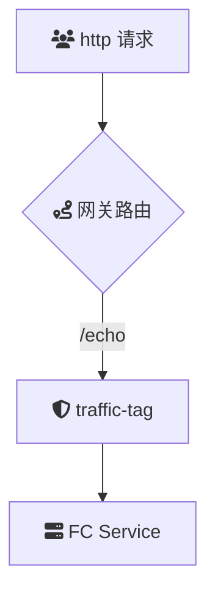

# 概述
**traffic-tag** 是一款用于云原生 API 网关的流量染色插件，通过在请求中添加特定的请求头，根据权重或特定请求内容对流量进行染色。该插件支持复杂的逻辑判断，允许用户根据自定义标准对流量进行精确染色，从而实现灰度发布、A/B 测试等高级流量控制和管理。

### 场景描述
在微服务架构和云原生应用中，灰度发布、A/B 测试和精细化的流量管理是常见需求。流量染色能够帮助开发团队将部分流量标记为特定类型，通过流量标记决定后续的路由策略、监控指标或业务逻辑处理。**traffic-tag** 插件提供了强大的流量染色功能，允许用户根据多种条件和权重灵活配置流量的染色规则，实现精准的流量控制和管理。

### 应用场景
1. **灰度发布**：在新版本发布时，将一部分流量染色为新版本流量，逐步释放，观察新版本的表现和稳定性。
2. **A/B 测试**：将流量分为不同的实验组，通过染色标记不同的用户或请求，评估不同方案或功能的效果。
3. **流量分配**：根据用户属性（如 VIP 用户、地域）对流量进行不同的分配策略，提供差异化服务。
4. **故障注入**：在特定条件下染色部分流量，模拟故障场景进行混沌测试，验证系统的健壮性和恢复能力。
5. **个性化路由**：根据请求内容或用户需求，将流量染色后，进行个性化的路由决策，提升用户体验。
6. **安全防护**：根据请求特征对流量进行标记，结合安全策略进行动态防护，如针对高风险流量进行严格审查。

### 解决问题
- **灵活的流量管理**：支持基于多种条件和权重的流量染色，满足复杂的流量管理需求，如动态调整不同版本或功能的流量比例。
- **实现灰度发布和 A/B 测试**：通过流量标记，方便进行新版本发布的灰度测试和产品功能的 A/B 实验，降低发布风险。
- **精细化的路由控制**：根据染色标签，实现更加细粒度的流量路由策略，提高系统的灵活性和扩展性。
- **提升监控与分析能力**：通过流量标记，可以更准确地追踪和分析不同类型流量的行为和性能指标，支持优化和改进决策。
- **提高系统稳定性与安全性**：在进行故障注入和混沌测试时，可以精确控制测试流量范围，确保主系统的稳定运行。同时，通过流量标记配合安全策略，可以有效防护恶意流量和攻击。

## 架构

## 部署

## usage