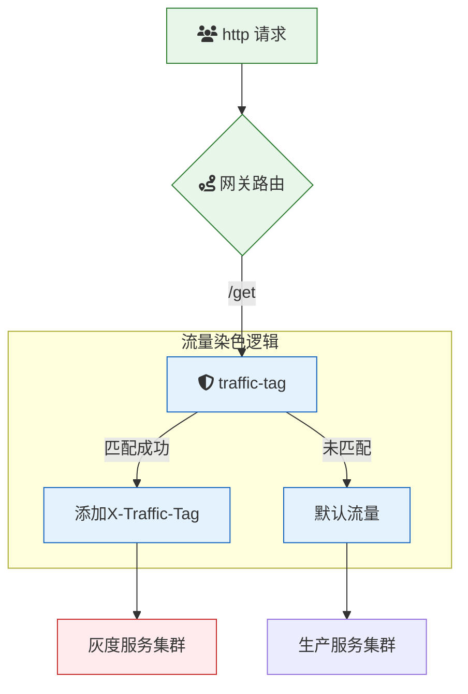

# 概述

**traffic-tag** 是一款用于云原生 API 网关的流量染色插件，通过在请求中添加特定的请求头，根据权重或特定请求内容对流量进行染色。该插件支持复杂的逻辑判断，允许用户根据自定义标准对流量进行精确染色，从而实现灰度发布、A/B 测试等高级流量控制和管理。

### 场景描述

在微服务架构和云原生应用中，灰度发布、A/B 测试和精细化的流量管理是常见需求。流量染色能够帮助开发团队将部分流量标记为特定类型，通过流量标记决定后续的路由策略、监控指标或业务逻辑处理。**traffic-tag** 插件提供了强大的流量染色功能，允许用户根据多种条件和权重灵活配置流量的染色规则，实现精准的流量控制和管理。

### 应用场景

1. **灰度发布**：在新版本发布时，将一部分流量染色为新版本流量，逐步释放，观察新版本的表现和稳定性。
2. **A/B 测试**：将流量分为不同的实验组，通过染色标记不同的用户或请求，评估不同方案或功能的效果。
3. **流量分配**：根据用户属性（如 VIP 用户、地域）对流量进行不同的分配策略，提供差异化服务。
4. **故障注入**：在特定条件下染色部分流量，模拟故障场景进行混沌测试，验证系统的健壮性和恢复能力。
5. **个性化路由**：根据请求内容或用户需求，将流量染色后，进行个性化的路由决策，提升用户体验。
6. **安全防护**：根据请求特征对流量进行标记，结合安全策略进行动态防护，如针对高风险流量进行严格审查。

### 解决问题

- **灵活的流量管理**：支持基于多种条件和权重的流量染色，满足复杂的流量管理需求，如动态调整不同版本或功能的流量比例。
- **实现灰度发布和 A/B 测试**：通过流量标记，方便进行新版本发布的灰度测试和产品功能的 A/B 实验，降低发布风险。
- **精细化的路由控制**：根据染色标签，实现更加细粒度的流量路由策略，提高系统的灵活性和扩展性。
- **提升监控与分析能力**：通过流量标记，可以更准确地追踪和分析不同类型流量的行为和性能指标，支持优化和改进决策。
- **提高系统稳定性与安全性**：在进行故障注入和混沌测试时，可以精确控制测试流量范围，确保主系统的稳定运行。同时，通过流量标记配合安全策略，可以有效防护恶意流量和攻击。

## 架构



本示例`traffic-tag`插件的配置如下：

> 更多配置详情，请查阅[Github 文档](https://github.com/alibaba/higress/blob/main/plugins/wasm-go/extensions/traffic-tag/README.md)

### 基于内容的匹配

```yaml
conditionGroups:
	- headerName: x-mse-tag
		headerValue: gray
		logic: and
		conditions:
		- conditionType: header
			key: role
			operator: in
			value:
			- user
			- viewer
			- editor
```

1. 发起未配置流量管控的请求
   首先，尝试不带任何流量管控信息发起请求：

```
curl -iv 'http://env-cu9g82mm1hkui0vcv5eg-cn-hangzhou.alicloudapi.com/get'
```

预期返回结果：

```
{
  "args": {},
  "headers": {
    "Accept-Encoding": "gzip",
    "Host": "trafficlugin-se-whnstlhcgx.cn-hangzhou-vpc.fcapp.run",
    "Original-Host": "env-cu9g82mm1hkui0vcv5eg-cn-hangzhou.alicloudapi.com",
    "Req-Start-Time": "1739156291202",
    "User-Agent": "Go-http-client/1.1",
    "X-Envoy-Attempt-Count": "1",
    "X-Envoy-Internal": "true",
    "X-Envoy-Original-Host": "env-cu9g82mm1hkui0vcv5eg-cn-hangzhou.alicloudapi.com",
    "X-Envoy-Route-Identifier": "true",
    "X-Fc-Access-Key-Id": "",
    "X-Fc-Access-Key-Secret": "",
    "X-Fc-Account-Id": "1419633767709936",
    "X-Fc-Api-Server-Ip": "",
    "X-Fc-Base-Path": "/get",
    "X-Fc-Client-Ip": "",
    "X-Fc-Control-Path": "/http-invoke",
    "X-Fc-Eagleeye-Rpcid": "",
    "X-Fc-Eagleeye-Traceid": "",
    "X-Fc-Eagleeye-Userdata": "",
    "X-Fc-Function-Handler": "index.handler",
    "X-Fc-Function-Memory": "1024",
    "X-Fc-Function-Name": "traffic-tag-plugin-1se3",
    "X-Fc-Function-Timeout": "3",
    "X-Fc-Qualifier": "LATEST",
    "X-Fc-Region": "cn-hangzhou",
    "X-Fc-Request-Id": "1-67a96b43-15d49184-5cdbe1911c57",
    "X-Fc-Retry-Count": "0",
    "X-Fc-Security-Token": "",
    "X-Fc-Service-Logproject": "",
    "X-Fc-Service-Logstore": "",
    "X-Fc-Service-Name": "",
    "X-Fc-Tracing-Jaeger-Endpoint": "",
    "X-Fc-Tracing-Opentracing-Span-Baggages": "",
    "X-Fc-Tracing-Opentracing-Span-Context": "",
    "X-Fc-Version-Id": ""
  },
  "origin": "172.16.19.194, 100.117.33.107",
  "url": "http,http://trafficlugin-se-whnstlhcgx.cn-hangzhou-vpc.fcapp.run/get"
}
```

2. 发起带安全防护参数的请求
   按照示例的配置，满足请求头 role 的值是 user、viwer、editor 其中之一，请求时将被添加请求头 x-mse-tag: gray。

```
curl -iv 'http://env-cu9g82mm1hkui0vcv5eg-cn-hangzhou.alicloudapi.com/get' -H 'role: user'
```

预期返回结果：

```
{
  "args": {},
  "headers": {
    "Accept-Encoding": "gzip",
    "Host": "trafficlugin-se-whnstlhcgx.cn-hangzhou-vpc.fcapp.run",
    "Original-Host": "env-cu9g82mm1hkui0vcv5eg-cn-hangzhou.alicloudapi.com",
    "Req-Start-Time": "1739156334690",
    "Role": "user",
    "User-Agent": "Go-http-client/1.1",
    "X-Envoy-Attempt-Count": "1",
    "X-Envoy-Internal": "true",
    "X-Envoy-Original-Host": "env-cu9g82mm1hkui0vcv5eg-cn-hangzhou.alicloudapi.com",
    "X-Envoy-Route-Identifier": "true",
    "X-Fc-Access-Key-Id": "",
    "X-Fc-Access-Key-Secret": "",
    "X-Fc-Account-Id": "1419633767709936",
    "X-Fc-Api-Server-Ip": "",
    "X-Fc-Base-Path": "/get",
    "X-Fc-Client-Ip": "",
    "X-Fc-Control-Path": "/http-invoke",
    "X-Fc-Eagleeye-Rpcid": "",
    "X-Fc-Eagleeye-Traceid": "",
    "X-Fc-Eagleeye-Userdata": "",
    "X-Fc-Function-Handler": "index.handler",
    "X-Fc-Function-Memory": "1024",
    "X-Fc-Function-Name": "traffic-tag-plugin-1se3",
    "X-Fc-Function-Timeout": "3",
    "X-Fc-Qualifier": "LATEST",
    "X-Fc-Region": "cn-hangzhou",
    "X-Fc-Request-Id": "1-67a96b6e-157b95ee-dc6a68ad7d33",
    "X-Fc-Retry-Count": "0",
    "X-Fc-Security-Token": "",
    "X-Fc-Service-Logproject": "",
    "X-Fc-Service-Logstore": "",
    "X-Fc-Service-Name": "",
    "X-Fc-Tracing-Jaeger-Endpoint": "",
    "X-Fc-Tracing-Opentracing-Span-Baggages": "",
    "X-Fc-Tracing-Opentracing-Span-Context": "",
    "X-Fc-Version-Id": "",
    "X-Mse-Tag": "gray"
  },
  "origin": "172.16.37.65, 100.117.33.211",
  "url": "http,http://trafficlugin-se-whnstlhcgx.cn-hangzhou-vpc.fcapp.run/get"
}
```

### 基于权重的匹配

```yaml
# 权重总和为100，下例中未配置的70权重将不添加header
weightGroups:
  - headerName: x-mse-tag
    headerValue: gray
    weight: 30
```

发起请求

```
curl -iv 'http://env-cu9g82mm1hkui0vcv5eg-cn-hangzhou.alicloudapi.com/get'
```

1. 未被匹配的权重，预期返回结果：

```
{
  "args": {},
  "headers": {
    "Accept-Encoding": "gzip",
    "Example-Test": "test",
    "Host": "requestplugin-p-hgaiodjhwz.cn-hangzhou-vpc.fcapp.run",
    "Original-Host": "env-cu9g82mm1hkui0vcv5eg-cn-hangzhou.alicloudapi.com",
    "Req-Start-Time": "1739007119680",
    "User-Agent": "Go-http-client/1.1",
    "X-Envoy-Attempt-Count": "1",
    "X-Envoy-Internal": "true",
    "X-Envoy-Original-Host": "env-cu9g82mm1hkui0vcv5eg-cn-hangzhou.alicloudapi.com",
    "X-Envoy-Route-Identifier": "true",
    "X-Fc-Access-Key-Id": "",
    "X-Fc-Access-Key-Secret": "",
    "X-Fc-Account-Id": "1419633767709936",
    "X-Fc-Api-Server-Ip": "",
    "X-Fc-Base-Path": "/get",
    "X-Fc-Client-Ip": "",
    "X-Fc-Control-Path": "/http-invoke",
    "X-Fc-Eagleeye-Rpcid": "",
    "X-Fc-Eagleeye-Traceid": "",
    "X-Fc-Eagleeye-Userdata": "",
    "X-Fc-Function-Handler": "index.handler",
    "X-Fc-Function-Memory": "1024",
    "X-Fc-Function-Name": "request-block-plugin-668p",
    "X-Fc-Function-Timeout": "3",
    "X-Fc-Qualifier": "LATEST",
    "X-Fc-Region": "cn-hangzhou",
    "X-Fc-Request-Id": "1-67a7248f-157f9e7f-ba1d831519dc",
    "X-Fc-Retry-Count": "0",
    "X-Fc-Security-Token": "",
    "X-Fc-Service-Logproject": "",
    "X-Fc-Service-Logstore": "",
    "X-Fc-Service-Name": "",
    "X-Fc-Tracing-Jaeger-Endpoint": "",
    "X-Fc-Tracing-Opentracing-Span-Baggages": "",
    "X-Fc-Tracing-Opentracing-Span-Context": "",
    "X-Fc-Version-Id": ""
  },
  "origin": "172.16.37.65, 100.117.33.211",
  "url": "http,http://requestplugin-p-hgaiodjhwz.cn-hangzhou-vpc.fcapp.run/get"
}
```

2. 匹配的权重，预期返回结果：

预期返回结果：

```
{
  "args": {},
  "headers": {
    "Accept-Encoding": "gzip",
    "Host": "trafficlugin-se-whnstlhcgx.cn-hangzhou-vpc.fcapp.run",
    "Original-Host": "env-cu9g82mm1hkui0vcv5eg-cn-hangzhou.alicloudapi.com",
    "Req-Start-Time": "1739156334690",
    "Role": "user",
    "User-Agent": "Go-http-client/1.1",
    "X-Envoy-Attempt-Count": "1",
    "X-Envoy-Internal": "true",
    "X-Envoy-Original-Host": "env-cu9g82mm1hkui0vcv5eg-cn-hangzhou.alicloudapi.com",
    "X-Envoy-Route-Identifier": "true",
    "X-Fc-Access-Key-Id": "",
    "X-Fc-Access-Key-Secret": "",
    "X-Fc-Account-Id": "1419633767709936",
    "X-Fc-Api-Server-Ip": "",
    "X-Fc-Base-Path": "/get",
    "X-Fc-Client-Ip": "",
    "X-Fc-Control-Path": "/http-invoke",
    "X-Fc-Eagleeye-Rpcid": "",
    "X-Fc-Eagleeye-Traceid": "",
    "X-Fc-Eagleeye-Userdata": "",
    "X-Fc-Function-Handler": "index.handler",
    "X-Fc-Function-Memory": "1024",
    "X-Fc-Function-Name": "traffic-tag-plugin-1se3",
    "X-Fc-Function-Timeout": "3",
    "X-Fc-Qualifier": "LATEST",
    "X-Fc-Region": "cn-hangzhou",
    "X-Fc-Request-Id": "1-67a96b6e-157b95ee-dc6a68ad7d33",
    "X-Fc-Retry-Count": "0",
    "X-Fc-Security-Token": "",
    "X-Fc-Service-Logproject": "",
    "X-Fc-Service-Logstore": "",
    "X-Fc-Service-Name": "",
    "X-Fc-Tracing-Jaeger-Endpoint": "",
    "X-Fc-Tracing-Opentracing-Span-Baggages": "",
    "X-Fc-Tracing-Opentracing-Span-Context": "",
    "X-Fc-Version-Id": "",
    "X-Mse-Tag": "gray"
  },
  "origin": "172.16.37.65, 100.117.33.211",
  "url": "http,http://trafficlugin-se-whnstlhcgx.cn-hangzhou-vpc.fcapp.run/get"
}
```
