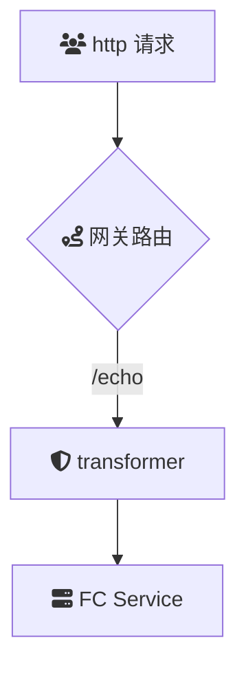

# Intro
**transformer**：请求响应转换

**transformer** 是一款功能强大的云原生 API 网关插件，旨在对 HTTP 请求和响应进行动态转换。该插件支持对请求/响应头、请求查询参数、请求/响应体参数等多种元素进行多种类型的转换操作，包括删除、重命名、更新、添加、追加、映射和去重。通过灵活配置，**transformer** 可满足不同业务场景下对流量和数据的定制化处理需求，提升 API 的兼容性和灵活性。

## Summary

### 场景描述
在现代微服务和云原生架构中，不同服务之间可能使用不同的数据格式和协议版本，这导致在服务间通信时需要进行数据转换和适配。此外，随着业务的发展，接口可能会经历版本迭代，客户端可能使用旧版本的接口进行调用。为了保证系统的兼容性和灵活性，API 网关需要具备强大的请求和响应转换能力，以适应各种复杂的业务需求和变化。**transformer** 插件通过提供多种转换操作，帮助开发团队在网关层实现统一的数据处理逻辑，简化后端服务的复杂性，提高系统的可维护性和扩展性。

### 应用场景
1. **接口适配与兼容**：
   - **版本兼容**：在推出新版本接口时，通过转换旧版本的请求参数或响应格式，确保旧客户端能够无缝过渡到新版本。
   - **数据格式转换**：将客户端使用的特定数据格式（如 XML）转换为后端服务所需的格式（如 JSON），或反之亦然。

2. **安全与隐私保护**：
   - **敏感信息隐藏**：在响应中删除或替换敏感数据（如用户密码、信用卡信息），确保数据隐私和安全。
   - **请求过滤**：删除请求中的敏感头信息，防止信息泄露。

3. **流量控制与优化**：
   - **参数校正**：对请求参数进行重命名或更新，确保后端服务能够正确解析和处理。
   - **内容调整**：根据业务需求动态调整响应内容，如增加返回字段或修改字段值，提高数据的适用性。

4. **A/B 测试与灰度发布**：
   - **动态内容调整**：根据特定条件（如用户群体、地理位置）对响应内容进行调整，用于 A/B 测试不同功能或版本的效果。
   - **流量染色**：结合流量标记，对特定流量进行内容转换，支持灰度发布策略。

5. **多租户与定制化服务**：
   - **租户数据隔离**：根据请求中的租户标识，对响应数据进行定制化处理，确保不同租户的数据隔离和个性化服务。
   - **定制化响应**：根据不同客户的需求，动态调整响应体内容，提供个性化的服务体验。

6. **日志记录与监控**：
   - **数据脱敏**：在日志记录过程中，通过转换操作脱敏敏感信息，确保日志安全。
   - **规范化数据**：将不同格式的请求和响应数据转换为统一格式，便于集中化监控和分析。

### 解决问题
- **提升系统兼容性**：通过对请求和响应进行必要的转换，确保不同版本和格式的接口能够兼容，减少后端服务的改动，提高系统的灵活性。
- **增强数据安全性**：通过删除或匿名化敏感信息，保护用户隐私，防止数据泄露，增强系统的安全性。
- **简化后端逻辑**：将数据转换逻辑下沉到 API 网关层，避免在后端服务中重复实现，降低开发和维护成本。
- **支持灵活的业务需求**：通过多种转换操作，满足复杂的业务需求，如动态调整响应内容、定制化服务等，提高业务的适应能力和扩展性。
- **优化性能和资源利用**：通过在网关层进行数据转换，减少后端服务的负载，提高整体系统的响应速度和资源利用效率。
- **提升用户体验**：通过对请求和响应进行优化和调整，确保客户端能够获得符合预期的数据格式和内容，提升用户的使用体验。
- **强化监控与管理**：通过规范化和脱敏处理，优化日志记录，增强系统的监控和管理能力，便于运维人员进行故障排查和性能优化。
- **支持快速迭代与部署**：允许在不改动后端服务的情况下，通过配置转换规则实现快速的接口调整和功能迭代，加快产品的迭代速度和响应市场需求的能力。

## Architecture

## deploy

## usage