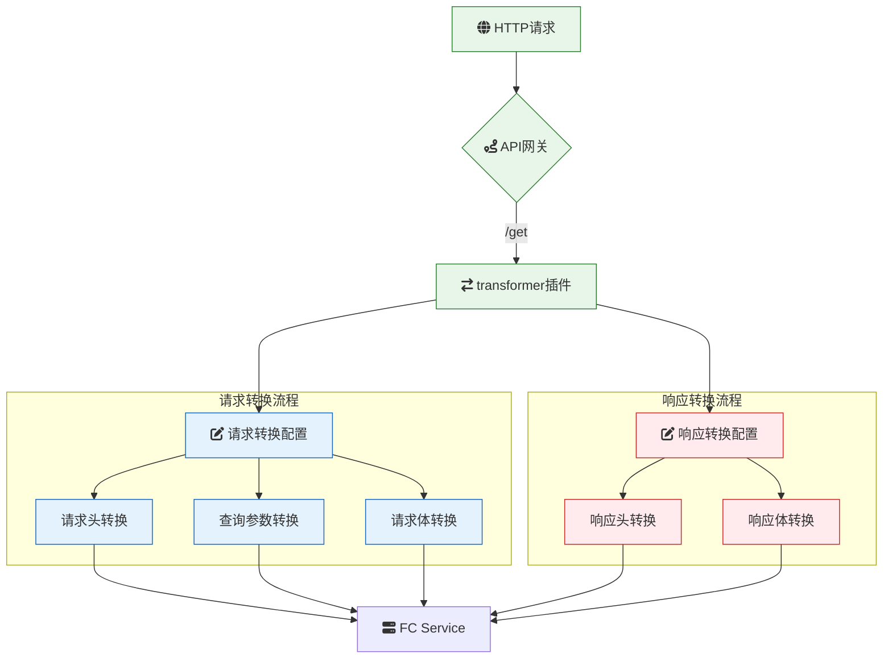

# 概述

**transformer**：请求响应转换

**transformer** 是一款功能强大的云原生 API 网关插件，旨在对 HTTP 请求和响应进行动态转换。该插件支持对请求/响应头、请求查询参数、请求/响应体参数等多种元素进行多种类型的转换操作，包括删除、重命名、更新、添加、追加、映射和去重。通过灵活配置，**transformer** 可满足不同业务场景下对流量和数据的定制化处理需求，提升 API 的兼容性和灵活性。

### 场景描述

在现代微服务和云原生架构中，不同服务之间可能使用不同的数据格式和协议版本，这导致在服务间通信时需要进行数据转换和适配。此外，随着业务的发展，接口可能会经历版本迭代，客户端可能使用旧版本的接口进行调用。为了保证系统的兼容性和灵活性，API 网关需要具备强大的请求和响应转换能力，以适应各种复杂的业务需求和变化。**transformer** 插件通过提供多种转换操作，帮助开发团队在网关层实现统一的数据处理逻辑，简化后端服务的复杂性，提高系统的可维护性和扩展性。

### 应用场景

1. **接口适配与兼容**：

   - **版本兼容**：在推出新版本接口时，通过转换旧版本的请求参数或响应格式，确保旧客户端能够无缝过渡到新版本。
   - **数据格式转换**：将客户端使用的特定数据格式（如 XML）转换为后端服务所需的格式（如 JSON），或反之亦然。

2. **安全与隐私保护**：

   - **敏感信息隐藏**：在响应中删除或替换敏感数据（如用户密码、信用卡信息），确保数据隐私和安全。
   - **请求过滤**：删除请求中的敏感头信息，防止信息泄露。

3. **流量控制与优化**：

   - **参数校正**：对请求参数进行重命名或更新，确保后端服务能够正确解析和处理。
   - **内容调整**：根据业务需求动态调整响应内容，如增加返回字段或修改字段值，提高数据的适用性。

4. **A/B 测试与灰度发布**：

   - **动态内容调整**：根据特定条件（如用户群体、地理位置）对响应内容进行调整，用于 A/B 测试不同功能或版本的效果。
   - **流量染色**：结合流量标记，对特定流量进行内容转换，支持灰度发布策略。

5. **多租户与定制化服务**：

   - **租户数据隔离**：根据请求中的租户标识，对响应数据进行定制化处理，确保不同租户的数据隔离和个性化服务。
   - **定制化响应**：根据不同客户的需求，动态调整响应体内容，提供个性化的服务体验。

6. **日志记录与监控**：
   - **数据脱敏**：在日志记录过程中，通过转换操作脱敏敏感信息，确保日志安全。
   - **规范化数据**：将不同格式的请求和响应数据转换为统一格式，便于集中化监控和分析。

### 解决问题

- **提升系统兼容性**：通过对请求和响应进行必要的转换，确保不同版本和格式的接口能够兼容，减少后端服务的改动，提高系统的灵活性。
- **增强数据安全性**：通过删除或匿名化敏感信息，保护用户隐私，防止数据泄露，增强系统的安全性。
- **简化后端逻辑**：将数据转换逻辑下沉到 API 网关层，避免在后端服务中重复实现，降低开发和维护成本。
- **支持灵活的业务需求**：通过多种转换操作，满足复杂的业务需求，如动态调整响应内容、定制化服务等，提高业务的适应能力和扩展性。
- **优化性能和资源利用**：通过在网关层进行数据转换，减少后端服务的负载，提高整体系统的响应速度和资源利用效率。
- **提升用户体验**：通过对请求和响应进行优化和调整，确保客户端能够获得符合预期的数据格式和内容，提升用户的使用体验。
- **强化监控与管理**：通过规范化和脱敏处理，优化日志记录，增强系统的监控和管理能力，便于运维人员进行故障排查和性能优化。
- **支持快速迭代与部署**：允许在不改动后端服务的情况下，通过配置转换规则实现快速的接口调整和功能迭代，加快产品的迭代速度和响应市场需求的能力。

## 架构



本示例 `transformer` 插件的配置如下：

> 更多配置详情，请查阅[Github 文档](https://github.com/alibaba/higress/blob/main/plugins/wasm-go/extensions/transformer/README.md)

### 实现基于 Body 参数路由

配置示例：

```yaml
reqRules:
  - operate: map
    headers:
      - fromKey: userId
        toKey: x-user-id
    mapSource: body
```

此规则将请求 body 中的`userId`解析出后，设置到请求 Header`x-user-id`中，这样就可以基于 Higress 请求 Header 匹配路由的能力来实现基于 Body 参数的路由了。

此配置同时支持`application/json`和`application/x-www-form-urlencoded`两种类型的请求 Body。

举例来说：

**对于 application/json 类型的 body**

```bash
curl localhost -d '{"userId":12, "userName":"johnlanni"}' -H 'content-type:application/json'
```

将从 json 中提取出`userId`字段的值，设置到`x-user-id`中，后端服务收到的请求头将增加:`x-usr-id: 12`。

因为在插件新增这个 Header 后，网关将重新计算路由，所以可以实现网关路由配置根据这个请求头来匹配路由到特定的目标服务。

**对于 application/x-www-form-urlencoded 类型的 body**

```bash
curl localhost -d 'userId=12&userName=johnlanni'
```

将从`k1=v1&k2=v2`这样的表单格式中提取出`userId`字段的值，设置到`x-user-id`中，后端服务收到的请求头将增加:`x-usr-id: 12`。

因为在插件新增这个 Header 后，网关将重新计算路由，所以可以实现网关路由配置根据这个请求头来匹配路由到特定的目标服务。

#### json path 支持

可以根据 [GJSON Path 语法](https://github.com/tidwall/gjson/blob/master/SYNTAX.md)，从复杂的 json 中提取出字段。

比较常用的操作举例，对于以下 json:

```json
{
  "name": { "first": "Tom", "last": "Anderson" },
  "age": 37,
  "children": ["Sara", "Alex", "Jack"],
  "fav.movie": "Deer Hunter",
  "friends": [
    {
      "first": "Dale",
      "last": "Murphy",
      "age": 44,
      "nets": ["ig", "fb", "tw"]
    },
    { "first": "Roger", "last": "Craig", "age": 68, "nets": ["fb", "tw"] },
    { "first": "Jane", "last": "Murphy", "age": 47, "nets": ["ig", "tw"] }
  ]
}
```

可以实现这样的提取:

```text
name.last              "Anderson"
name.first             "Tom"
age                    37
children               ["Sara","Alex","Jack"]
children.0             "Sara"
children.1             "Alex"
friends.1              {"first": "Roger", "last": "Craig", "age": 68}
friends.1.first        "Roger"
```

现在如果想从上面这个 json 格式的 body 中提取出 friends 中第二项的 first 字段，来设置到 Header `x-first-name` 中，同时抽取 last 字段，来设置到 Header `x-last-name` 中，则可以使用这份插件配置:

```yaml
reqRules:
  - operate: map
    headers:
      - fromKey: friends.1.first
        toKey: x-first-name
      - fromKey: friends.1.last
        toKey: x-last-name
    mapSource: body
```

### Request Transformer

#### 转换请求头部

```yaml
reqRules:
  - operate: remove
    headers:
      - key: X-remove
  - operate: rename
    headers:
      - oldKey: X-not-renamed
        newKey: X-renamed
  - operate: replace
    headers:
      - key: X-replace
        newValue: replaced
  - operate: add
    headers:
      - key: X-add-append
        value: host-$1
        host_pattern: ^(.*)\.com$
  - operate: append
    headers:
      - key: X-add-append
        appendValue: path-$1
        path_pattern: ^.*?\/(\w+)[\?]{0,1}.*$
  - operate: map
    headers:
      - fromKey: X-add-append
        toKey: X-map
  - operate: dedupe
    headers:
      - key: X-dedupe-first
        strategy: RETAIN_FIRST
      - key: X-dedupe-last
        strategy: RETAIN_LAST
      - key: X-dedupe-unique
        strategy: RETAIN_UNIQUE
```

发送请求

```bash
$ curl -v console.higress.io/get -H 'host: foo.bar.com' \
-H 'X-remove: exist' -H 'X-not-renamed:test' -H 'X-replace:not-replaced' \
-H 'X-dedupe-first:1' -H 'X-dedupe-first:2' -H 'X-dedupe-first:3' \
-H 'X-dedupe-last:a' -H 'X-dedupe-last:b' -H 'X-dedupe-last:c' \
-H 'X-dedupe-unique:1' -H 'X-dedupe-unique:2' -H 'X-dedupe-unique:3' \
-H 'X-dedupe-unique:3' -H 'X-dedupe-unique:2' -H 'X-dedupe-unique:1'

# httpbin 响应结果
{
  "args": {},
  "headers": {
    ...
    "X-Add-Append": "host-foo.bar,path-get",
    ...
    "X-Dedupe-First": "1",
    "X-Dedupe-Last": "c",
    "X-Dedupe-Unique": "1,2,3",
    ...
    "X-Map": "host-foo.bar,path-get",
    "X-Renamed": "test",
    "X-Replace": "replaced"
  },
  ...
}
```

#### 转换请求查询参数

```yaml
reqRules:
  - operate: remove
    querys:
      - key: k1
  - operate: rename
    querys:
      - oldKey: k2
        newKey: k2-new
  - operate: replace
    querys:
      - key: k2-new
        newValue: v2-new
  - operate: add
    querys:
      - key: k3
        value: v31-$1
        path_pattern: ^.*?\/(\w+)[\?]{0,1}.*$
  - operate: append
    querys:
      - key: k3
        appendValue: v32
  - operate: map
    querys:
      - fromKey: k3
        toKey: k4
  - operate: dedupe
    querys:
      - key: k4
        strategy: RETAIN_FIRST
```

发送请求

```bash
$ curl -v "console.higress.io/get?k1=v11&k1=v12&k2=v2"

# httpbin 响应结果
{
  "args": {
    "k2-new": "v2-new",
    "k3": [
      "v31-get",
      "v32"
    ],
    "k4": "v31-get"
  },
  ...
  "url": "http://foo.bar.com/get?k2-new=v2-new&k3=v31-get&k3=v32&k4=v31-get"
}
```

#### 转换请求体

```yaml
reqRules:
  - operate: remove
    body:
      - key: a1
  - operate: rename
    body:
      - oldKey: a2
        newKey: a2-new
  - operate: replace
    body:
      - key: a3
        newValue: t3-new
        value_type: string
  - operate: add
    body:
      - key: a1-new
        value: t1-new
        value_type: string
  - operate: append
    body:
      - key: a1-new
        appendValue: t1-$1-append
        value_type: string
        host_pattern: ^(.*)\.com$
  - operate: map
    body:
      - fromKey: a1-new
        toKey: a4
  - operate: dedupe
    body:
      - key: a4
        strategy: RETAIN_FIRST
```

发送请求：

**1. Content-Type: application/json**

```bash
$ curl -v -x POST console.higress.io/post -H 'host: foo.bar.com' \
-H 'Content-Type: application/json' -d '{"a1":"t1","a2":"t2","a3":"t3"}'

# httpbin 响应结果
{
  ...
  "headers": {
    ...
    "Content-Type": "application/json",
    ...
  },
  "json": {
    "a1-new": [
      "t1-new",
      "t1-foo.bar-append"
    ],
    "a2-new": "t2",
    "a3": "t3-new",
    "a4": "t1-new"
  },
  ...
}
```

**2. Content-Type: application/x-www-form-urlencoded**

```bash
$ curl -v -X POST console.higress.io/post -H 'host: foo.bar.com' \
-d 'a1=t1&a2=t2&a3=t3'

# httpbin 响应结果
{
  ...
  "form": {
    "a1-new": [
      "t1-new",
      "t1-foo.bar-append"
    ],
    "a2-new": "t2",
    "a3": "t3-new",
    "a4": "t1-new"
  },
  "headers": {
    ...
    "Content-Type": "application/x-www-form-urlencoded",
    ...
  },
  ...
}
```

**3. Content-Type: multipart/form-data**

```bash
$ curl -v -X POST console.higress.io/post -H 'host: foo.bar.com' \
-F a1=t1 -F a2=t2 -F a3=t3

# httpbin 响应结果
{
  ...
  "form": {
    "a1-new": [
      "t1-new",
      "t1-foo.bar-append"
    ],
    "a2-new": "t2",
    "a3": "t3-new",
    "a4": "t1-new"
  },
  "headers": {
    ...
    "Content-Type": "multipart/form-data; boundary=------------------------1118b3fab5afbc4e",
    ...
  },
  ...
}
```

### Response Transformer

与 Request Transformer 类似，在此仅说明转换 JSON 形式的请求/响应体时的注意事项：

#### key 嵌套 `.`

1.通常情况下，指定的 key 中含有 `.` 表示嵌套含义，如下：

```yaml
respRules:
  - operate: add
    body:
      - key: foo.bar
        value: value
```

```bash
$ curl -v console.higress.io/get

# httpbin 响应结果
{
 ...
 "foo": {
  "bar": "value"
 },
 ...
}
```

2.当使用 `\.` 对 key 中的 `.` 进行转义后，表示非嵌套含义，如下：

> 当使用双引号括住字符串时使用 `\\.` 进行转义

```yaml
respRules:
  - operate: add
    body:
      - key: foo\.bar
        value: value
```

```bash
$ curl -v console.higress.io/get

# httpbin 响应结果
{
 ...
 "foo.bar": "value",
 ...
}
```

#### 访问数组元素 `.index`

可以通过数组下标 `array.index 访问数组元素，下标从 0 开始：

```json
{
  "users": [
    {
      "123": { "name": "zhangsan", "age": 18 }
    },
    {
      "456": { "name": "lisi", "age": 19 }
    }
  ]
}
```

1.移除 `user` 第一个元素：

```yaml
reqRules:
  - operate: remove
    body:
      - key: users.0
```

```bash
$ curl -v -X POST console.higress.io/post \
-H 'Content-Type: application/json' \
-d '{"users":[{"123":{"name":"zhangsan"}},{"456":{"name":"lisi"}}]}'

# httpbin 响应结果
{
  ...
  "json": {
    "users": [
      {
        "456": {
          "name": "lisi"
        }
      }
    ]
  },
  ...
}
```

2.将 `users` 第一个元素的 key 为 `123` 重命名为 `msg`:

```yaml
reqRules:
  - operate: rename
    body:
      - oldKey: users.0.123
        newKey: users.0.first
```

```bash
$ curl -v -X POST console.higress.io/post \
-H 'Content-Type: application/json' \
-d '{"users":[{"123":{"name":"zhangsan"}},{"456":{"name":"lisi"}}]}'


# httpbin 响应结果
{
  ...
  "json": {
    "users": [
      {
        "msg": {
          "name": "zhangsan"
        }
      },
      {
        "456": {
          "name": "lisi"
        }
      }
    ]
  },
  ...
}
```

#### 遍历数组元素 `.#`

可以使用 `array.#` 对数组进行遍历操作：

> ❗️ 该操作目前只能用在 replace 上，请勿在其他转换中尝试该操作，以免造成无法预知的结果

```json
{
  "users": [
    {
      "name": "zhangsan",
      "age": 18
    },
    {
      "name": "lisi",
      "age": 19
    }
  ]
}
```

```yaml
reqRules:
  - operate: replace
    body:
      - key: users.#.age
        newValue: 20
```

```bash
$ curl -v -X POST console.higress.io/post \
-H 'Content-Type: application/json' \
-d '{"users":[{"name":"zhangsan","age":18},{"name":"lisi","age":19}]}'


# httpbin 响应结果
{
  ...
  "json": {
    "users": [
      {
        "age": "20",
        "name": "zhangsan"
      },
      {
        "age": "20",
        "name": "lisi"
      }
    ]
  },
  ...
}
```
