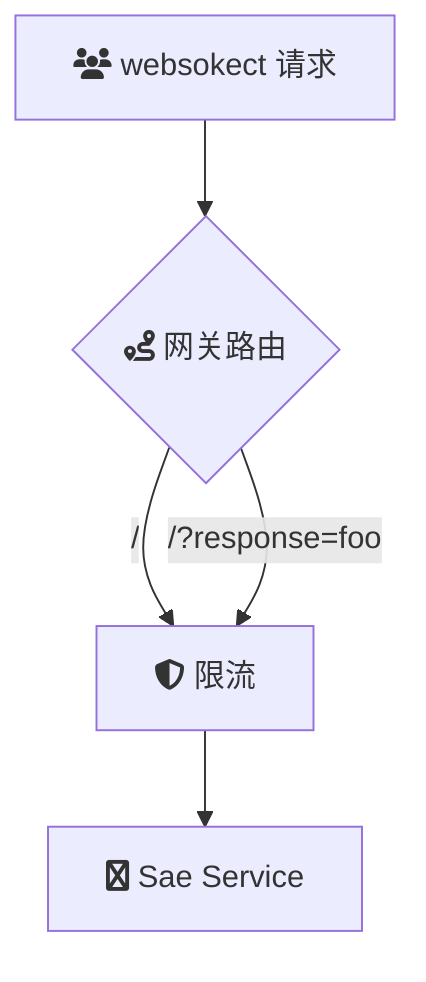

# 概述
云原生 API 网关实现 WebSocket 服务的转发

### 场景描述
云原生 API 网关通过动态路由、协议转换和智能负载均衡能力，有效解决 WebSocket 服务在分布式架构中的长连接管理、安全防护和高可用性问题，支撑实时双向通信场景的规模化落地。
### 应用场景
1. **实时数据流传输**
	 - 大模型多模态场景（文本/语音/图像混合输入），需保障消息完整性及传输效率。
   - 物联网设备状态实时监控（每秒千级消息吞吐）
   - 金融交易行情推送（低延迟强一致性要求）
   - 多人在线游戏同步（高并发长连接管理）
2. **交互式业务系统**
   - 在线文档协同编辑（操作指令实时同步）
   - 视频会议信令控制（媒体协商与状态同步）
   - 如OpenAI Realtime API支持低延迟的多模态交互（会话上下文保持）
### 解决问题
1. **协议层兼容**  
   实现 HTTP/HTTPS 与 WebSocket 协议的无缝转换（包括 Connection Upgrade 机制），支持 WSS 加密传输，自动处理 101 状态码切换协议过程。
2. **优雅上下线**  
	当用户进行网关升级时和配置变更，会执行 drain 机制时，会逐步下线旧连接。网关接受websocket drain信号，执行优雅关闭策略
3. **流量治理能力**
   - 基于 CIDR/IP 的精细化限流策略
   - 消息级 QoS 控制（最大帧长/速率限制）
   - 灰度发布支持（基于 Header/Weight 的路由分流）
4. **可观测性增强**  
   提供连接数、消息吞吐量、异常断开率等维度监控指标，结合分布式追踪（如 OpenTelemetry）实现全链路消息审计。
5. **安全防护体系**  
   集成 JWT/OAuth2.0 身份验证，防范 DDoS 攻击（集成WAF 防护），实施 TLS 1.3 加密传输，支持基于 SNI 的证书动态加载。
## 架构

## 部署

## 使用